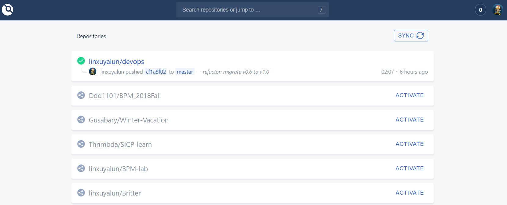
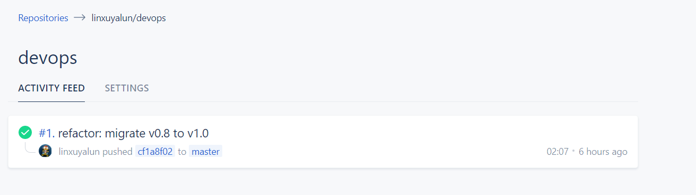

# Argus

[](http://47.112.23.163:8081/linxuyalun/devops)
[-blue.svg)](https://github.com/linxuyalun/devops/master/LICENSE)
<a href="https://996.icu"></a>

Argus is the assignment of **Software Innovation and R&D Management**.

## Team Members

* 曹峻铭[@JamesCao2048](https://github.com/JamesCao2048)
* 姚朋[@pengy14](https://github.com/pengy14)
* 林许亚伦[@linxuyalun](https://github.com/linxuyalun)

## Idea

Our idea is to build a platform which provides the main function. It can trigger an event via email to inform the user of the discount of commodity that they want. The basic procedure is as followed:
* register
* search commodities in taobao or jingdong with key words
* add commodities to listening list
* start listening
* send an email when get a discount

### Advantages
* no need to login jingdong or taobao
* integration of multiple electronic business platforms

## Configure and run Drone server in single machine

The process of configuring and running Drone server in single machine can be seen on this [page](https://docs.drone.io/installation/github/single-machine/).

The main difference between the tutorial and our project is we use `docker-compose` to manage docker containers:

`docker-compose.yml`:

```yaml
version: '2'

services:
  drone-server:
    image: drone/drone:1.0.0
    ports:
      - 8081:80
    volumes:
      - ./:/data
      - /var/run/docker.sock:/var/run/docker.sock
    restart: always
    environment:
      - DRONE_SERVER_HOST=${DRONE_SERVER_HOST}
      - DRONE_SERVER_PROTO=${DRONE_SERVER_PROTO}
      - DRONE_TLS_AUTOCERT=false
      - DRONE_RUNNER_CAPACITY=3
      # GitHub Config
      - DRONE_GITHUB_SERVER=https://github.com
      - DRONE_GITHUB_CLIENT_ID=${DRONE_GITHUB_CLIENT_ID}
      - DRONE_GITHUB_CLIENT_SECRET=${DRONE_GITHUB_CLIENT_SECRET}
      - DRONE_LOGS_PRETTY=true
      - DRONE_LOGS_COLOR=true
```

All sensitive information has been stored in `.env`.

To start the drone server, run

```
docker-compose -f docker-compose.yml up
```

Ideally, when go to `www.your-drone-server.com`, Drone will first ask for authorization from GitHub, and then synchronous all repositories from the corresponding account:



To continuously integrate, a `.drone.yml` is required in a repo, here's an example of `.drone.yml`:

```yaml
kind: pipline
name: demo

steps:
- name: node1
  image: node:11.12.0
  commands:
  - echo "this is testing"

- name: node2
  image: node:11.12.0
  commands:
  - sleep 10
  - echo "sleep 10"
```

Ideally, every time a member push or pull request, GitHub will activate a web hook created by Drone server. Drone server then integrates the project base on the information from `.drone.yml` and show the activity feed on Drone UI:

There are some details when configure and run Drone server. This [guide](https://discourse.drone.io/t/nothing-happens-when-i-push-code-no-builds-or-builds-stuck-in-pending/3424) troubleshoot the scenario where code is pushed and nothing happens in Drone. 

