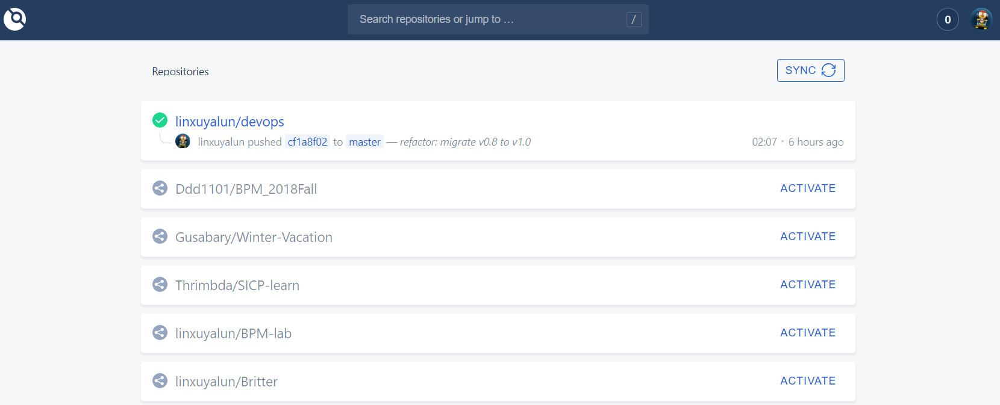
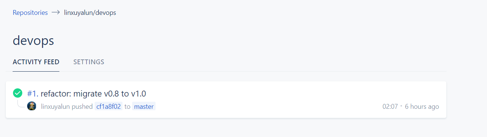
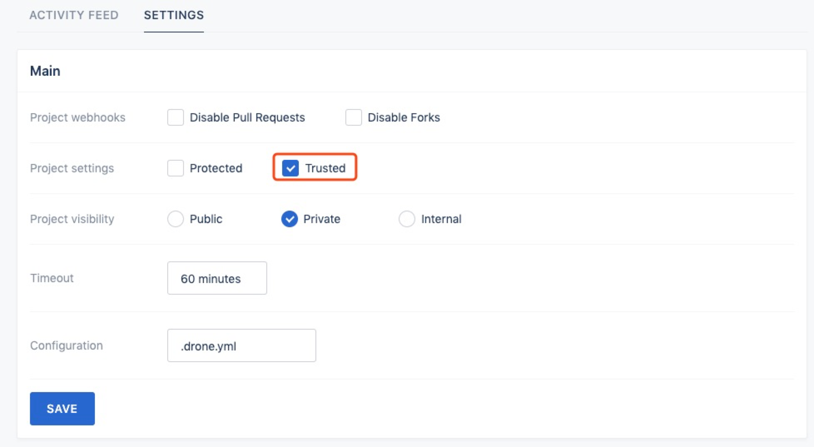
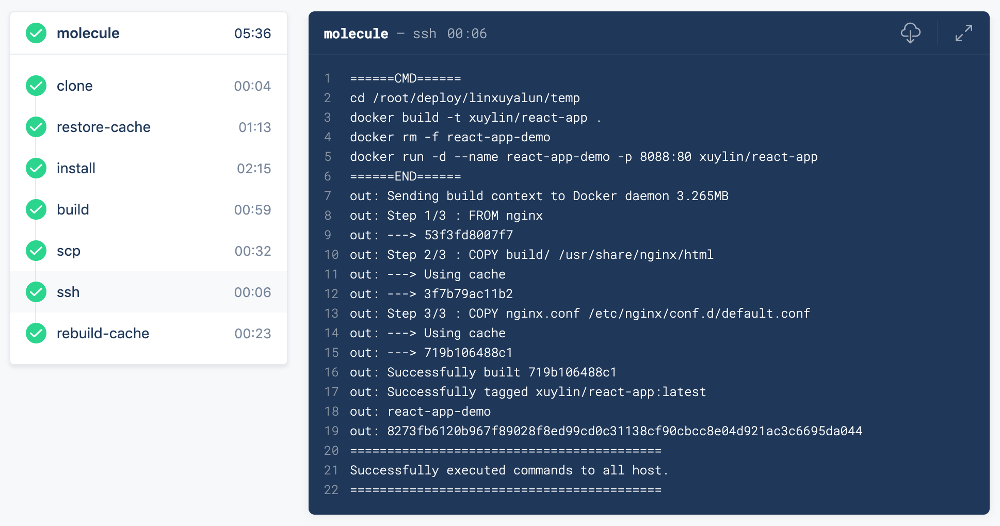
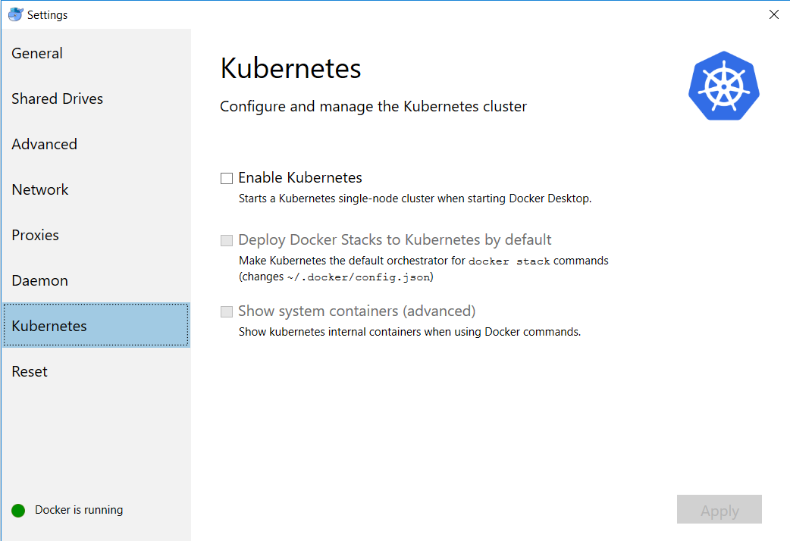
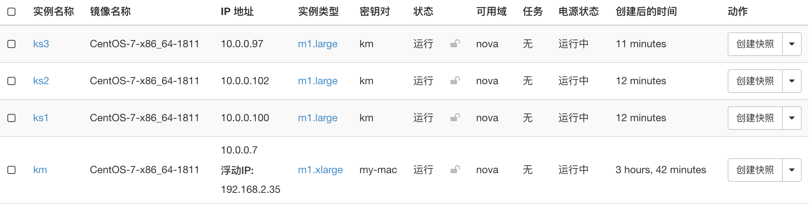
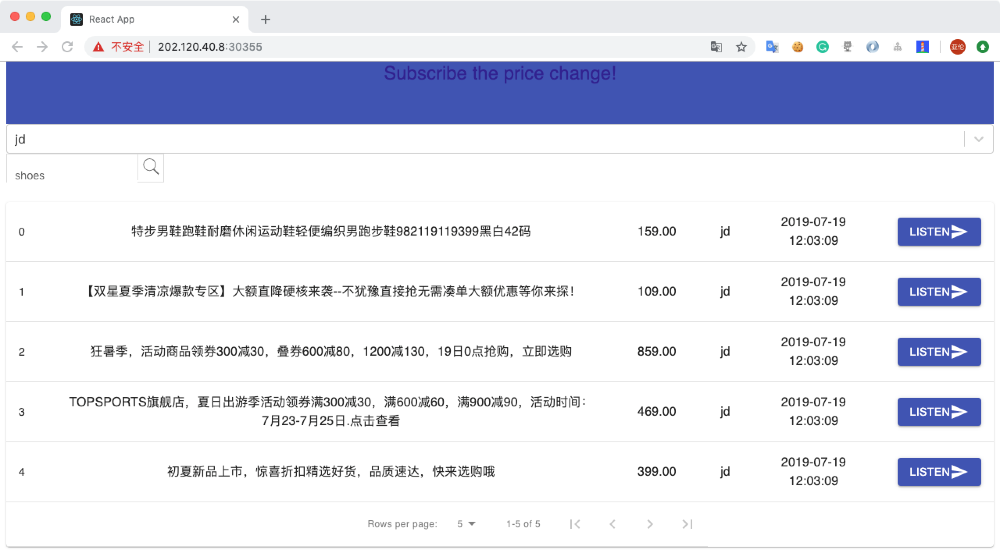
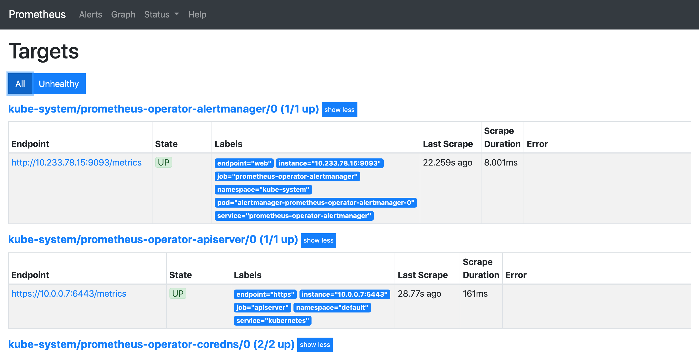
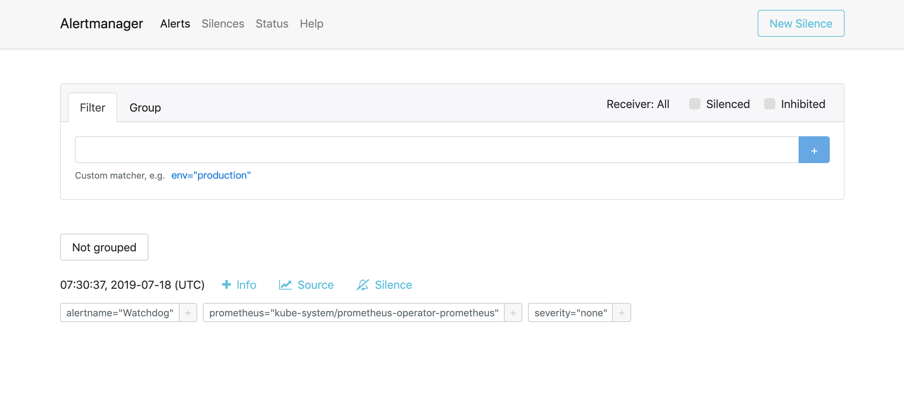
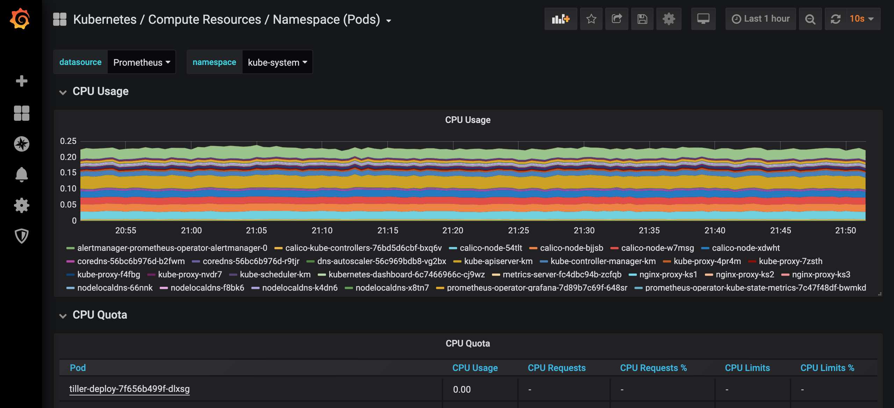

# Cloud Native Guide

# Continous Integration & Delivery

Drone is our CI/CD tool, see [Issue #2](https://github.com/linxuyalun/devops/issues/2) to learn about why we choose it.

## Configure and run Drone server in single machine

The process of configuring and running Drone server in single machine can be seen on this [page](https://docs.drone.io/installation/github/single-machine/).

The main difference between the tutorial and our project is we use `docker-compose` to manage docker containers:

`docker-compose.yml`:

```yaml
version: '2'

services:
  drone-server:
    image: drone/drone:1.0.0
    ports:
      - 8081:80
    volumes:
      - ./:/data
      - /var/run/docker.sock:/var/run/docker.sock
    restart: always
    environment:
      - DRONE_SERVER_HOST=${DRONE_SERVER_HOST}
      - DRONE_SERVER_PROTO=${DRONE_SERVER_PROTO}
      - DRONE_TLS_AUTOCERT=false
      - DRONE_RUNNER_CAPACITY=3
      - DRONE_LOGS_PRETTY=true
      - DRONE_LOGS_COLOR=true
      - DRONE_USER_CREATE=username:linxuyalun,admin:true
      # GitHub Config
      - DRONE_GITHUB_SERVER=https://github.com
      - DRONE_GITHUB_CLIENT_ID=${DRONE_GITHUB_CLIENT_ID}
      - DRONE_GITHUB_CLIENT_SECRET=${DRONE_GITHUB_CLIENT_SECRET}
```

All sensitive information has been stored in `.env`.

To start the drone server, run:

```
docker-compose -f $FILE_NAME up -d
```

Ideally, when go to `www.your-drone-server.com`, Drone will first ask for authorization from GitHub, and then synchronous all repositories from the corresponding account:



To continuously integrate, a `.drone.yml` is required in a repo, here's an example of `.drone.yml`:

```yaml
kind: pipline
name: demo

steps:
- name: node1
  image: node:11.12.0
  commands:
  - echo "this is testing"

- name: node2
  image: node:11.12.0
  commands:
  - sleep 10
  - echo "sleep 10"
```

Ideally, every time a member push or pull request, GitHub will activate a web hook created by Drone server. Drone server then integrates the project base on the information from `.drone.yml` and show the activity feed on Drone UI:

There are some details when configure and run Drone server. This [guide](https://discourse.drone.io/t/nothing-happens-when-i-push-code-no-builds-or-builds-stuck-in-pending/3424) troubleshoot the scenario where code is pushed and nothing happens in Drone. 

Now just play with it! To make full use of Drone, plugins are needed. Go through the [market page](http://plugins.drone.io/) and choose whatever you want  🥴 

## CI/CD in practice

Assume that we gonna develop a front end application, the following content gives you a guide of how to devops.

### Volume cache

When we write an application, it's really common that we need to install vast dependencies to support our application, which costs several minutes. In order to reduce this part costs, we can apply [**volume cache**](http://plugins.drone.io/drillster/drone-volume-cache/) in our CI/CD.

This plugin requires Volume configuration. This means your repository Trusted flag must be enabled. So we need to set our account as admin first — amend our `docker-compose.yml`:

```yaml
version: '2'

services:
  drone-server:
    image: drone/drone:1.0.0
    ports:
      - 8081:80
    volumes:
      - ./:/data
      - /var/run/docker.sock:/var/run/docker.sock
    restart: always
    environment:
      - DRONE_SERVER_HOST=${DRONE_SERVER_HOST}
      - DRONE_SERVER_PROTO=${DRONE_SERVER_PROTO}
      - DRONE_TLS_AUTOCERT=false
      - DRONE_RUNNER_CAPACITY=3
      - DRONE_LOGS_PRETTY=true
      - DRONE_LOGS_COLOR=true
      # Add admin account
      - DRONE_USER_CREATE=username:linxuyalun,admin:true
      # GitHub Config
      - DRONE_GITHUB_SERVER=https://github.com
      - DRONE_GITHUB_CLIENT_ID=${DRONE_GITHUB_CLIENT_ID}
      - DRONE_GITHUB_CLIENT_SECRET=${DRONE_GITHUB_CLIENT_SECRET}
```

See [full privilege](https://docs.drone.io/administration/user/admins/) of an admin here.

Restart the container:

```bash
> docker-compose -f docker-compose.yml up -d
Recreating devops_drone-server_1
```

Then we can go to a specific repo and setting it as trusted:



Modify `.drone.yml`:

```yaml
kind: pipline
name: molecule

steps:
- name: restore-cache
  image: drillster/drone-volume-cache
  volumes:
  - name: cache
    path: /cache
  settings:
    restore: true
    mount:
    - ./node_modules
    - ./yarn-cache

- name: install
  image: node:11.13.0
  commands:
  - echo "Install dependencies 🧐🤪🤪"
  - yarn --version
  - yarn cache dir
  - yarn config set cache-folder /drone/src/yarn-cache
  - yarn install --pure-lockfile
  - echo "Install successfully 🏰🏰🏰"

- name: rebuild-cache
  image: drillster/drone-volume-cache
  volumes:
  - name: cache
    path: /cache
  settings:
    rebuild: true
    mount:
    - ./node_modules
    - ./yarn-cache

volumes:
  - name: cache
    host:
      path: /root/tmp/cache
```

To learn the meaning of the above params, see [here](http://plugins.drone.io/drillster/drone-volume-cache/).

### SCP

The [SCP plugin](http://plugins.drone.io/appleboy/drone-scp/) copy files and artifacts to target host machine via SSH. 

Because this is a front end application, there is no need to upload source files. We can first build the source code and then just upload these static files and other related configuration files.

```yaml
kind: pipline
name: molecule

steps:
- name: restore-cache
  image: drillster/drone-volume-cache
  volumes:
  - name: cache
    path: /cache
  settings:
    restore: true
    mount:
    - ./node_modules
    - ./yarn-cache

- name: install
  image: node:11.13.0
  commands:
  - echo "Install dependencies 🧐🤪🤪"
  - yarn --version
  - yarn cache dir
  - yarn config set cache-folder /drone/src/yarn-cache
  - yarn install --pure-lockfile
  - echo "Install successfully 🏰🏰🏰"

- name: build
  image: node:11.13.0
  commands:
  - echo "Build the application ⛑⛑⛑"
  - yarn cache dir
  - yarn build
  - echo "Build successfully 🗿🗿🗿"

- name: scp
  image: appleboy/drone-scp
  settings:
    host: example.host.com
    username: root
    password:
      from_secret: ssh_password
    target: /root/deploy/${DRONE_REPO}
    source:
    - build
    - Dockerfile
    - nginx.conf
    rm: true

- name: rebuild-cache
  image: drillster/drone-volume-cache
  volumes:
  - name: cache
    path: /cache
  settings:
    rebuild: true
    mount:
    - ./node_modules
    - ./yarn-cache

volumes:
  - name: cache
    host:
      path: /root/tmp/cache
```

Here in our `scp` pipeline, we also send `Dockerfile` and `nginx.conf`. The remote server will use these two files to launch a container of our application.

### SSH

Use the [SSH plugin](http://plugins.drone.io/appleboy/drone-ssh/) to execute commands on a remote server. The process is very similar to **SCP**, and the contents are also easy to understand.

```yaml
kind: pipline
name: molecule

steps:
- name: restore-cache
  image: drillster/drone-volume-cache
  volumes:
  - name: cache
    path: /cache
  settings:
    restore: true
    mount:
    - ./node_modules
    - ./yarn-cache

- name: install
  image: node:11.13.0
  commands:
  - echo "Install dependencies 🧐🤪🤪"
  - yarn --version
  - yarn cache dir
  - yarn config set cache-folder /drone/src/yarn-cache
  - yarn install --pure-lockfile
  - echo "Install successfully 🏰🏰🏰"

- name: build
  image: node:11.13.0
  commands:
  - echo "Build the application ⛑⛑⛑"
  - yarn cache dir
  - yarn build
  - echo "Build successfully 🗿🗿🗿"

- name: scp
  image: appleboy/drone-scp
  settings:
    host: example.host.com
    username: root
    password:
      from_secret: ssh_password
    rm: true
    target: /root/deploy/${DRONE_REPO}
    source:
    - build
    - Dockerfile
    - nginx.conf

- name: ssh
  image: appleboy/drone-ssh
  settings:
    host: example.host.com
    username: root
    password:
      from_secret: ssh_password
    script:
      - cd /root/deploy/${DRONE_REPO}
      - docker build -t xuylin/react-app .
      - docker rm -f react-app-demo
      - docker run -d --name react-app-demo -p 8088:80 xuylin/react-app

- name: rebuild-cache
  image: drillster/drone-volume-cache
  volumes:
  - name: cache
    path: /cache
  settings:
    rebuild: true
    mount:
    - ./node_modules
    - ./yarn-cache

volumes:
  - name: cache
    host:
      path: /root/tmp/cache
```

And here is the `Dockerfile` and `nginx.conf` in case of need:

`Dockerfile`:

```dockerfile
FROM nginx

COPY build/ /usr/share/nginx/html

COPY nginx.conf /etc/nginx/conf.d/default.conf
```

`nginx.conf`:

```
server {
    listen 80;
    server_name localhost;
    location / {
        root   /usr/share/nginx/html;
        index  index.html;
        try_files $uri /index.html;
    }
    location ~* /app.*\.(js|css|png|jpg)$
    {
        access_log off;
        expires    365d;
    }
    location ~* /app.*\.(?:manifest|appcache|html?|xml|json)$
    {
        expires    -1;
    }
}
```

If there is no error in your pipeline, you may see the following content:



And from now on, you build an automatic devops pipeline successfully!

### Build the application in Docker (optional)

If you wouldn't like to build the application in Drone, you can build it just in the Dockerfile.

First, `Dockerfile` needs revision.

```dockerfile
# Stage 0, based on Node.js, to build and compile the frontend
FROM node:11.13.0 as build-stage

WORKDIR /app

COPY package.json /app/

RUN yarn install

COPY ./ /app/

RUN yarn build

# Stage 1 based on Nginx, to have only the compiled app, ready for production with Nginx
FROM nginx

COPY --from=build-stage /app/build/ /usr/share/nginx/html

COPY --from=build-stage /app/nginx.conf /etc/nginx/conf.d/default.conf
```

Modify our `scp ` in `.drone.yml`:

```yaml
kind: pipline
name: molecule

steps:
- name: restore-cache
  image: drillster/drone-volume-cache
  volumes:
  - name: cache
    path: /cache
  settings:
    restore: true
    mount:
    - ./node_modules
    - ./yarn-cache

- name: install
  image: node:11.13.0
  commands:
  - echo "Install dependencies 🧐🤪🤪"
  - yarn --version
  - yarn cache dir
  - yarn config set cache-folder /drone/src/yarn-cache
  - yarn install --pure-lockfile
  - echo "Install successfully 🏰🏰🏰"

- name: scp
  image: appleboy/drone-scp
  settings:
    host: example.host.com
    username: root
    password:
      from_secret: ssh_password
    rm: true
    target: /root/deploy/${DRONE_REPO}
    source:
    - src
    - public
    - package.json
    - Dockerfile
    - nginx.conf

- name: ssh
  image: appleboy/drone-ssh
  settings:
    host: example.host.com
    username: root
    password:
      from_secret: ssh_password
    script:
      - cd /root/deploy/${DRONE_REPO}
      - docker build -t xuylin/react-app .
      - docker rm -f react-app-demo
      - docker run -d --name react-app-demo -p 8088:80 xuylin/react-app

- name: rebuild-cache
  image: drillster/drone-volume-cache
  volumes:
  - name: cache
    path: /cache
  settings:
    rebuild: true
    mount:
    - ./node_modules
    - ./yarn-cache

volumes:
  - name: cache
    host:
      path: /root/tmp/cache
```

This is also an options of CI/CD, but it's really hard to say which one is better. For me, I prefer the former, which looks more general.

# Scheduling & Orchestration Overview

As the only graduated scheduling and orchestration project in CNCF, k8s is no wonder the first choice. Learn basic knowledge of Kubernetes [here](https://kubernetes.io/docs/tutorials/).

## Start a Kubernetes single-node cluster

To start a Kubernetes single node cluster, several methods can be used.

### Minikube

Minikube implements a local Kubernetes cluster on macOS, Linux, and Windows. Its [goal](https://github.com/kubernetes/minikube/blob/master/docs/contributors/principles.md) is to enable fast local development and to support all Kubernetes features that fit. 

#### Installation

See [Install Minikube](https://kubernetes.io/docs/tasks/tools/install-minikube/) (**Do notice the prerequisites of different OS**). You can also download minikube from its [GitHub repo](https://github.com/kubernetes/minikube/releases), which just released the latest version Minikube v1.0.0 recently.

#### Quick start

If your server is not in China, run the following command is totally enough:

```shell
minikube start
```

However, because of the firewall, it's really hard to download resource from `k8s.gcr.io`. So you must using Minikube with an HTTP Proxy.

```shell
# macOS and Linux
export HTTP_PROXY=http://<proxy hostname:port>
export HTTPS_PROXY=http://<proxy hostname:port>
export NO_PROXY=localhost,127.0.0.1,10.96.0.0/12,192.168.99.0/24,192.168.39.0/24

# Windows
set HTTP_PROXY=http://<proxy hostname:port>
set HTTPS_PROXY=http://<proxy hostname:port>
set NO_PROXY=localhost,127.0.0.1,10.96.0.0/12,192.168.99.1/24,192.168.39.0/24


minikube start --docker-env=HTTP_PROXY=$HTTP_PROXY \
			   --docker-env HTTPS_PROXY=$HTTPS_PROXY \
               --docker-env NO_PROXY=$NO_PROXY
```

#### Troubleshooting

1. Do set `HTTPS_PROXY=http://<proxy hostname:port>` instead of `HTTPS_PROXY=https://<proxy hostname:port>`, or you will get an error of `"tls: oversized record received with length 20527"`. See this [issue](https://github.com/kubernetes/kubernetes/issues/15839).
2. If you can't download `minikube-v1.0.0.iso`, you can download [it](https://storage.googleapis.com/minikube/iso/minikube-v1.0.0.iso) manually and place this file in `.minikube/cache/iso`. Run `minikube start` again.
3. Any problems of HTTP Proxy? This [doc](https://github.com/kubernetes/minikube/blob/master/docs/http_proxy.md) may help you.
4. If you are a Windows user and you want to start minikube with Hyper-V, following this [guide](https://medium.com/@JockDaRock/minikube-on-windows-10-with-hyper-v-6ef0f4dc158c).

### Docker-for-Desktop

Docker Desktop is the fastest and simplest way to get a Kubernetes cluster running on your desktop machine, while still giving you the freedom to choose Docker Swarm if you prefer. If you are a macOS user or Windows user, you can start a k8s single node cluster by Docker.



Choose `Enable Kubernetes` and `Apply` it, a k8s single-node cluster will then be installed and started. Again, don't forget to set proxy!

### microk8s

#### Quick start

Microk8s is a single package of k8s that installs on Linux. It’s not elastic, but it is on rails. Use it for offline development, prototyping, testing, or use it on a VM as a small, cheap, reliable k8s for CI/CD.

Follow this [guide](https://tutorials.ubuntu.com/tutorial/install-a-local-kubernetes-with-microk8s#0) to install microk8s.

A proxy is needed, see [how to deploy behind a proxy](https://microk8s.io/docs/#deploy-behind-a-proxy).

Enable `dns` and `dashboard`:

`microk8s.enable dns dashboard`

If everything goes well, the following messages will be shown when run `microk8s.inspect`

```
Inspecting services
  Service snap.microk8s.daemon-containerd is running
  Service snap.microk8s.daemon-apiserver is running
  Service snap.microk8s.daemon-proxy is running
  Service snap.microk8s.daemon-kubelet is running
  Service snap.microk8s.daemon-scheduler is running
  Service snap.microk8s.daemon-controller-manager is running
  Service snap.microk8s.daemon-etcd is running
  Copy service arguments to the final report tarball
Inspecting AppArmor configuration
Gathering system info
  Copy network configuration to the final report tarball
  Copy processes list to the final report tarball
  Copy snap list to the final report tarball
  Inspect kubernetes cluster

Building the report tarball
  Report tarball is at /var/snap/microk8s/492/inspection-report-20190331_105134.tar.gz
```

To check the deployment progress of our addons, run `microk8s.kubectl get all --all-namespaces`:

```
NAMESPACE     NAME                                                  READY   STATUS    RESTARTS   AGE
kube-system   pod/heapster-v1.5.2-6b5d7b57f9-rgjzx                  4/4     Running   0          11h
kube-system   pod/kube-dns-6bfbdd666c-s6q65                         3/3     Running   2          11h
kube-system   pod/kubernetes-dashboard-6fd7f9c494-p6zrq             1/1     Running   0          13h
kube-system   pod/monitoring-influxdb-grafana-v4-78777c64c8-rjrcl   2/2     Running   0          13h

NAMESPACE     NAME                           TYPE        CLUSTER-IP      EXTERNAL-IP   PORT(S)             AGE
default       service/kubernetes             ClusterIP   10.152.183.1    <none>        443/TCP             13h
kube-system   service/heapster               ClusterIP   10.152.183.30   <none>        80/TCP              13h
kube-system   service/kube-dns               ClusterIP   10.152.183.10   <none>        53/UDP,53/TCP       13h
kube-system   service/kubernetes-dashboard   ClusterIP   10.152.183.67   <none>        443/TCP             13h
kube-system   service/monitoring-grafana     ClusterIP   10.152.183.35   <none>        80/TCP              13h
kube-system   service/monitoring-influxdb    ClusterIP   10.152.183.47   <none>        8083/TCP,8086/TCP   13h

NAMESPACE     NAME                                             READY   UP-TO-DATE   AVAILABLE   AGE
kube-system   deployment.apps/heapster-v1.5.2                  1/1     1            1           13h
kube-system   deployment.apps/kube-dns                         1/1     1            1           13h
kube-system   deployment.apps/kubernetes-dashboard             1/1     1            1           13h
kube-system   deployment.apps/monitoring-influxdb-grafana-v4   1/1     1            1           13h

NAMESPACE     NAME                                                        DESIRED   CURRENT   READY   AGE
kube-system   replicaset.apps/heapster-v1.5.2-5c5498f57c                  0         0         0       13h
kube-system   replicaset.apps/heapster-v1.5.2-6b5d7b57f9                  1         1         1       11h
kube-system   replicaset.apps/heapster-v1.5.2-89b48dff                    0         0         0       11h
kube-system   replicaset.apps/kube-dns-6bfbdd666c                         1         1         1       13h
kube-system   replicaset.apps/kubernetes-dashboard-6fd7f9c494             1         1         1       13h
kube-system   replicaset.apps/monitoring-influxdb-grafana-v4-78777c64c8   1         1         1       13h
```

Make sure that all pods are in the "Running" state.

See cluster information with `microk8s.kubectl cluster-info`:

```
Kubernetes master is running at https://127.0.0.1:16443
Heapster is running at https://127.0.0.1:16443/api/v1/namespaces/kube-system/services/heapster/proxy
KubeDNS is running at https://127.0.0.1:16443/api/v1/namespaces/kube-system/services/kube-dns:dns/proxy
Grafana is running at https://127.0.0.1:16443/api/v1/namespaces/kube-system/services/monitoring-grafana/proxy
InfluxDB is running at https://127.0.0.1:16443/api/v1/namespaces/kube-system/services/monitoring-influxdb:http/proxy
```

#### Troubleshooting

1. If you deploy microk8s on a remote machine, username and password are required when visit the machine. Right now this username/password are random strings created at MicroK8s install time. You should be able to add more uses in `/var/snap/microk8s/current/credentials/basic_auth.csv`. You can read more [here](https://kubernetes.io/docs/reference/access-authn-authz/authentication/#static-password-file).
2. If your pod's status is not "RUNNING", for example, but "ImagePullBackOff". You can run `microk8s.kubectl describe pod <pod-id>` to find out what's happening. More information about [how to debug “ImagePullBackOff”?](https://stackoverflow.com/questions/34848422/how-to-debug-imagepullbackoff)

Now you can dive into it and do some experiments! ✌️

## Kubernetes demo

You can learn about `kubectl` document which was just rewritten in k8s 1.14 [here](https://kubectl.docs.kubernetes.io/).

All files in the following demos can be found [here](../k8s-demo).

### Demo 01 - Secrets

**Aim**: Learn about how to mount secret file into containers.

`kustomization.yaml`

```yaml
apiVersion: kustomize.config.k8s.io/v1beta1
kind: Kustomization

resources:
- deployment.yaml

namespace: default

secretGenerator:
- name: db-secrets
  files:
  - "secret/username"
  - "secret/password"
  type: Opaque
```

`deployment.yaml`

```yaml
apiVersion: apps/v1
kind: Deployment
metadata:
  name: helloworld-deployment
  labels:
    app: helloworld
spec:
  replicas: 3
  selector:
    matchLabels:
      app: helloworld
  template:
    metadata:
      labels:
        app: helloworld
    spec:
      containers:
      - name: k8s-demo
        image: wardviaene/k8s-demo
        ports:
        - name: nodejs-port
          containerPort: 3000
        volumeMounts:
        - name: cred-volume
          mountPath: /etc/creds
          readOnly: true
      volumes:
      - name: cred-volume
        secret:
          secretName: db-secrets
```

Run Apply on directories containing `kustomization.yaml` files using `-k`

```
kubectl apply -k .
```

The following messages shows that you created the pods successfully

```
secret/db-secrets-k87mg5mgmk created
deployment.apps/helloworld-deployment created
```

Get pods:

```
NAME                                     READY   STATUS    RESTARTS   AGE
helloworld-deployment-586989ffdd-kvqs7   1/1     Running   0          22s
helloworld-deployment-586989ffdd-l6kr9   1/1     Running   0          22s
helloworld-deployment-586989ffdd-wcpwc   1/1     Running   0          22s
```

Then describe one pod:

```bash
kubectl describe pod helloworld-deployment-586989ffdd-kvqs7
```

```
# Output
Name:               helloworld-deployment-586989ffdd-kvqs7
Namespace:          default
Priority:           0
PriorityClassName:  <none>
Node:               alan/172.18.51.81
Start Time:         Fri, 03 May 2019 11:00:11 +0800
Labels:             app=helloworld
                    pod-template-hash=586989ffdd
Annotations:        <none>
Status:             Running
IP:                 10.1.1.30
Controlled By:      ReplicaSet/helloworld-deployment-586989ffdd
Containers:
  k8s-demo:
    Container ID:   containerd://beecf1fe98abbec7dd22ca733269e17099fca6b55a3bebf32e2b6d78c199b7d4
    Image:          wardviaene/k8s-demo
    Image ID:       docker.io/wardviaene/k8s-demo@sha256:2c050f462f5d0b3a6430e7869bcdfe6ac48a447a89da79a56d0ef61460c7ab9e
    Port:           3000/TCP
    Host Port:      0/TCP
    State:          Running
      Started:      Fri, 03 May 2019 11:00:18 +0800
    Ready:          True
    Restart Count:  0
    Environment:    <none>
    Mounts:
      /etc/creds from cred-volume (ro)
      /var/run/secrets/kubernetes.io/serviceaccount from default-token-b5hpj (ro)
Conditions:
  Type              Status
  Initialized       True
  Ready             True
  ContainersReady   True
  PodScheduled      True
  Volumes:
  cred-volume:
    Type:        Secret (a volume populated by a Secret)
    SecretName:  db-secrets-k87mg5mgmk
    Optional:    false
  default-token-b5hpj:
    Type:        Secret (a volume populated by a Secret)
    SecretName:  default-token-b5hpj
    Optional:    false
QoS Class:       BestEffort
Node-Selectors:  <none>
Tolerations:     node.kubernetes.io/not-ready:NoExecute for 300s
                 node.kubernetes.io/unreachable:NoExecute for 300s
Events:
  Type    Reason     Age   From               Message
  ----    ------     ----  ----               -------
  Normal  Scheduled  39s   default-scheduler  Successfully assigned default/helloworld-deployment-586989ffdd-kvqs7 to alan
  Normal  Pulling    38s   kubelet, alan      Pulling image "wardviaene/k8s-demo"
  Normal  Pulled     32s   kubelet, alan      Successfully pulled image "wardviaene/k8s-demo"
  Normal  Created    32s   kubelet, alan      Created container k8s-demo
  Normal  Started    32s   kubelet, alan      Started container k8s-demo
```

You can see that we successfully mount the secrets files into containers:

```
Mounts:
  /etc/creds from cred-volume (ro)
  /var/run/secrets/kubernetes.io/serviceaccount from default-token-b5hpj (ro)
```

One important thing is Kubernetes also uses the Secretes in the volumes to share the Kubernetes credentials:

```
/var/run/secrets/kubernetes.io/serviceaccount from default-token-b5hpj (ro)
```

This is a volume that is already mounted and is done by Kubernetes itself to share the secrets within the pod so the pod can access the API.

So let's start a shell:

```
kubectl exec -it helloworld-deployment-586989ffdd-kvqs7 -- /bin/bash
root@helloworld-deployment-586989ffdd-kvqs7:/app# cd ../etc/creds
root@helloworld-deployment-586989ffdd-kvqs7:/etc/creds# ls
password  username
root@helloworld-deployment-586989ffdd-kvqs7:/etc/creds# cat password
password
root@helloworld-deployment-586989ffdd-kvqs7:/etc/creds# cat username
root
```

### Demo 02 - Running Apllication Using the Secrets

**Aim**: Set up an apllication(e.g. WordPress) using the secrets.

In this demo, it does not involve stateful containers yet, that means that whenever you put data in this WordPress, it's not going to be persistent. 

`kustomization.yaml`

```yaml
apiVersion: kustomize.config.k8s.io/v1beta1
kind: Kustomization

resources:
- deployment.yaml
- service.yaml

namespace: default

secretGenerator:
- name: wordpress-secrets
  files:
  - "secret/db-password"
  type: Opaque
```

`deployment.yaml`

```yaml
apiVersion: apps/v1
kind: Deployment
metadata:
  name: wordpress-deployment
  labels:
    app: wordpress
spec:
  replicas: 1
  selector:
    matchLabels:
      app: wordpress
  template:
    metadata:
      labels:
        app: wordpress
    spec:
      containers:
      - name: wordpress
        image: wordpress:4-php7.0
        ports:
        - name: http-port
          containerPort: 80
        env:
        - name: WORDPRESS_DB_PASSWORD
          valueFrom:
            secretKeyRef:
              name: wordpress-secrets
              key: db-password
        - name: WORDPRESS_DB_HOST
          value: 127.0.0.1
      - name: mysql
        image: mysql:5.7
        ports:
        - name: mysql-port
          containerPort: 3306
        env:
        - name: MYSQL_ROOT_PASSWORD
          valueFrom:
            secretKeyRef:
              name: wordpress-secrets
              key: db-password
```

We'd like to access the WordPress, thus we set up a Service and expose the port (e.g. 31000).

`service.yaml`

```yaml
apiVersion: v1
kind: Service
metadata:
  name:  wordpress-service
spec:
  selector:
    app: wordpress
  type: NodePort
  ports:
  - name: wordpress-service
    port: 31000
    nodePort: 31000
    targetPort: http-port
    protocol: TCP
```

Apply the above files:

```bash
kubectl apply -k .
```

And we set up the WordPress successfully!

```
> kubectl get pods
NAME                                    READY   STATUS    RESTARTS   AGE
wordpress-deployment-5d8449fcdb-7s48d   2/2     Running   0          15m
```

Then we can play with it - choose a language, register, write a post and so on. However, do remember these data is all not persistent because the containers we created are cattles.

### Demo 03 - Service Discovery

**Aim**: Connect different services by service discovery

`kustomization.yaml`

```yaml
apiVersion: kustomize.config.k8s.io/v1beta1
kind: Kustomization

resources:
- database-deployment.yaml
- database-service.yaml
- helloworld-deployment.yaml
- helloworld-service.yaml

namespace: default

secretGenerator:
- name: helloworld-secrets
  files:
  - "secret/username"
  - "secret/password"
  - "secret/rootPassword"
  - "secret/database"
  type: Opaque 
```

`database-deployment.yaml`

```yaml
apiVersion: apps/v1
kind: Deployment
metadata:
  name: database-deployment
  labels:
    app: database
spec:
  replicas: 1
  selector:
    matchLabels:
      app: database
  template:
    metadata:
      labels:
        app: database
    spec:
      containers:
      - name: mysql
        image: mysql:5.7
        ports:
        - name: mysql-port
          containerPort: 3306
        env:
        - name: MYSQL_ROOT_PASSWORD
          valueFrom:
            secretKeyRef:
              name: helloworld-secrets
              key: rootPassword
        - name: MYSQL_USER
          valueFrom:
            secretKeyRef:
              name: helloworld-secrets
              key: username
        - name: MYSQL_PASSWORD
          valueFrom:
            secretKeyRef:
              name: helloworld-secrets
              key: password
        - name: MYSQL_DATABASE
          valueFrom:
            secretKeyRef:
              name: helloworld-secrets
              key: database
```

`database-service.yaml`

```yaml
apiVersion: v1
kind: Service
metadata:
  name: database-service # service name
spec:
  selector:
    app: database
  type: NodePort
  ports:
  - name: database-service
    port: 3306
    targetPort: mysql-port
    protocol: TCP
```

`helloworld-deployment.yaml`

```yaml
apiVersion: apps/v1
kind: Deployment
metadata:
  name: helloworld-deployment
  labels:
    app: helloworld
spec:
  replicas: 3
  selector:
    matchLabels:
      app: helloworld
  template:
    metadata:
      labels:
        app: helloworld
    spec:
      containers:
      - name: k8s-demo
        image: wardviaene/k8s-demo
        command: ["node", "index-db.js"]
        ports:
        - name: nodejs-port
          containerPort: 3000
        env:
        - name: MYSQL_HOST
          value: database-service		# service descovery, thanks to DNS
        - name: MYSQL_USER
          value: root
        - name: MYSQL_PASSWORD
          valueFrom:
            secretKeyRef:
              name: helloworld-secrets
              key: rootPassword
        - name: MYSQL_DATABASE
          valueFrom:
            secretKeyRef:
              name: helloworld-secrets
              key: database
```

`helloworld-service.yaml`

```yaml
apiVersion: v1
kind: Service
metadata:
  name:  helloword-service
spec:
  selector:
    app: helloword
  type: NodePort
  ports:
  - name: helloword-service
    port: 3000
    nodePort: 31001
    protocol: TCP
```

Apply the above files:

```bash
kubectl apply -k .
```

To make sure that the  application has connected to database, we can check the logs:

```
kubectl logs helloworld-deployment-6bfd7b6df6-sz2r4
```

Here's the output, indicating connecting to database successfully:

```
Example app listening at http://:::3000
Connection to db established
```

### Demo 04 - Volumes

**Aim**: Say hello to volumes

We have already see `Volumes` in demo 1, now let's learn more about it.

Kubernetes [supports several types of Volumes](https://kubernetes.io/docs/concepts/storage/volumes/#types-of-volumes). In our demo, we will use `hostPath` volume, which mounts a file or directory from the host node’s filesystem into your Pod.   

To make the demo easy, we won't apply `kustomization.yaml` this time, one file is pretty enough.

`volume.yaml`

```yaml
apiVersion: v1
kind: Pod
metadata:
  name: hello-volume
spec:
  containers:
  - image: busybox
    name: busybox1
    command:
    - /bin/sh
    - -c
    - "while true; do echo hello; sleep 10; done"
    volumeMounts:
    - name: hello-volume
      mountPath: /test-pd
  - image: busybox
    name: busybox2
    command:
    - /bin/sh
    - -c
    - "while true; do echo hello; sleep 10; done"
    volumeMounts:
    - name: hello-volume
      mountPath: /test-pd
  volumes:
  - name: hello-volume
    hostPath:
      path: /root/data	# need to be created in advance
```

```
kubectl apply -f volume.yaml
```

Now we can see two pods have been set up:

```
NAME                        READY   STATUS    RESTARTS   AGE
hello-volume                2/2     Running   0          17m
```

Note that `/root/data` on your local machine and `/test-pd` in your containers share the data:

```bash
> touch test
> echo hello >> test
> cat test
	hello

> kubectl exec -it hello-volume sh
  Defaulting container name to busybox1.
  Use 'kubectl describe pod/hello-volume -n default' to see all of the containers in this pod.
  / # cd /test-pd/
  /test-pd # more test
  hello
  /test-pd # echo goodbye >> test
  /test-pd # exit

> cat test
	hello
	goodbye
```

# Kubernetes in Practice

Kubernetes is not only kubernetes. Thanks to its ecosystem, it brings today's kubernetes glorious. The following contents will give you a graphic description of kubernetes ecosystem.

## Cluster Overview

Here's my environment:



The cluster managed by [OpenStack](https://www.openstack.org/) has four VMs. The master `km` is bounded by a public ip,  and other three `ks`s are only have private ip. I can connect to `km` by ssh key from my local PC, and `km` can also connect to three `ks`s by ssh key.

To deploy kubernetes, docker is required. I recommand you to try my [configure script](https://github.com/linxuyalun/oh-my-os) after you creating a new VM. It helps you install some essential tools, including vim, Docker, python3 (which you will need later) and zsh (just comment it if you are not a zsh follower)

## Deploy kubernetes in a cluster

We will use kubespray, a tool to deploy a production ready k8s cluster, to deploy k8s in my cluster.

Kubespray uses [ansible](https://github.com/ansible/ansible) to help users deploy k8s quickly. The main idea of Kubespary is that it writes the pipeline of deploying kubernetes in ansible playbooks, and configure the cluster recorded in `inventory.ini` customized by users. Learn more about kubespray [here](https://kubespray.io/#/).

If your cluster is not in China, just follow the guide in kubespray. Otherwise, you can continue to read my document. It's not easy to deploy k8s in China because of the GFW.

### Download offline files

You can follow this [article](https://veiasai.github.io/2019/04/17/kubespray-%E8%B6%85%E5%BF%AB%E4%B9%90%E7%9A%84offline%E5%AE%89%E8%A3%85k8s/) to learn how to download essential files under the GFW. Anyway, proxy is needed.   The main idea of this ariticle is that he configured only one VM in `inventory.ini`，so the only thing he needed to do is making sure the proxy works in this VM.

Fortunately, all these offline files have been pre-downloaded.

```bash
> curl 10.0.0.26/list

.
├── inventory.ini
├── kube-1.13.5
│   ├── kube-1.13.5.tar
│   ├── kubespray-v2.9.0.tar.gz
│   └── releases
│       ├── cni-plugins-amd64-v0.6.0.tgz
│       ├── hyperkube
│       └── kubeadm
├── kube-1.14.1
│   ├── kube-1.14.1.tar
│   ├── kubespray-2.10.0.tar.gz
│   └── releases
│       ├── calicoctl
│       ├── cni-plugins-amd64-v0.6.0.tgz
│       ├── hyperkube
│       └── kubeadm
├── kube-install.sh
└── list
```

I will use kubespray 2.10.0 to deploy kubernetes 1.14.1, download the above files to my `km` root home:

```bash
pwd # /root
wget -r 10.0.0.26/kube-1.14.1
```

Extract kubespray and create own inventory:

```bash
cd kube-1.14.1
tar xzf kubespray-2.10.0.tar.gz .
cd kubespary-2.10.0
cp -r inventory/sample inventory/mycluster
```

In order to have a pure environment, use `pipenv` to create a virtual environment:

```bash
pwd # /root/kube-1.14.1/kubespray-2.10.0
pipenv --three shell
pipenv install -r requirement.txt
```

### Edit `ini` in your inventory

Configure `kube-1.14.1/kubespray-2.10.0/inventory/mycluster/inventory.ini`

```ini
[all]
km ansible_host=10.0.0.7 ansible_ssh_user=root
ks1 ansible_host=10.0.0.100 ansible_ssh_user=root
ks2 ansible_host=10.0.0.102 ansible_ssh_user=root
ks3 ansible_host=10.0.0.97 ansible_ssh_user=root

[kube-master]
km

[etcd]
ks1
ks2
ks3

[kube-node]
km
ks1
ks2
ks3

[k8s-cluster:children]
kube-master
kube-node
```

Points of this file:

- Each section uses the node name defined by `[all]`

- `[kube-master]`: your kubernetes master
- `[etcd]`: Your etcd node, should be odd. When I configured my cluster, I set `[etcd]` as single km at first. However, this resulted in faild to access etcd server. And when I set the `[etcd]` number as three nodes, the issue fixed. I haven't figured out the reson yet.
- `[kube-node]`: All kubernetes node

### Verify the calico mtu

> my path: `kube-x.xx.x/kubespray/inventory/mycluster/group_vars/k8s-cluster/k8s-net-calico.yml`

Compute your MTU sizes based on your environment.

For example, I use OpenStack VXLAN and Calico MTU with IP-in-IP, so here MTU is 1430.

(If you use OpenStack VXLAN, you must modify this value, because OpenStack VXLAN will cut and drop the overlong package.)

### Edit script `build.sh`

Cause we have already downloaded related files, downloading steps in ansible script can be commented.

`~/kube-1.14.1/kubespray-2.10.0/cluster.yml`

```yaml
# ...
- hosts: k8s-cluster:etcd:calico-rr
any_errors_fatal: "{{ any_errors_fatal | default(true) }}"
roles:
    - { role: kubespray-defaults}
    - { role: kubernetes/preinstall, tags: preinstall }
    # - { role: "container-engine", tags: "container-engine", when: deploy_container_engine|default(true) }
    # - { role: download, tags: download, when: "not skip_downloads" }
environment: "{{proxy_env}}"
# ...
```

And then, we need to load images into each node's Docker, and we need to place files into right place. We can do this automatically by a script. Before that, configre  `/etc/hosts`  to write my script more convenient.

 `/etc/hosts`

```
127.0.0.1 localhost localhost.localdomain localhost4 localhost4.localdomain4 km
::1 localhost6 localhost6.localdomain6 localhost6.localdomain
10.0.0.97 ks3
10.0.0.102 ks2
10.0.0.100 ks1
```

Note that the function of this file is setting nickname of ip. In fact, kubespray will also update this file after installation acoording to `inventory.ini`.

`~/build.sh`

```bash
# Config version
version=1.14.1
kubeDir=kube-${version}

# Config hosts
hosts=(km ks1 ks2 ks3)

for host in ${hosts[@]}
do
  scp -r ${kubeDir}/releases ${host}:/tmp/
  scp ${kubeDir}/kube-1.14.1.tar ${host}:~/

  ssh ${host} "sudo cp /tmp/releases/kubeadm /usr/local/bin/kubeadm &&
               sudo chmod +x /usr/local/bin/kubeadm"

  ssh ${host} "sudo docker load -i kube-1.14.1.tar"
done

ansible-playbook -i ${kubeDir}/kubespray-2.10.0/inventory/mycluster/inventory.ini --become --become-user=root ${kubeDir}/kubespray-2.10.0/cluster.yml

ssh ${host[0]} "mkdir ~/.kube/ &&
                sudo cp /etc/kubernetes/admin.conf ~/.kube/config &&
                sudo chmod 666 ~/.kube/config"
```

Details in this script

- `km ks1 ks2 ks3` are set in `/etc/hosts`. If not set, use ip instead;
- Make sure Docker is installed in each node, or `docker load -i kube-1.14.1.tar` can't be executed;
- In my script, I move `kubeadm` to `/usr/local/bin/kubeadm`. The reason is in kubespray, operating of copying `kubeadm` to `/usr/local/bin/kubeadm`  is written in ansible playbook Download part, and we just commented this part before;
- `kubeadm` has no exec right by default, add this right manually.

Run the script then:

```bash
chmod +x build.sh
./build.sh
```

Deploy successfully:

```
> kubectl get nodes
NAME   STATUS   ROLES    AGE     VERSION
km     Ready    master   12m   v1.14.1
ks1    Ready    <none>   11m   v1.14.1
ks2    Ready    <none>   11m   v1.14.1
ks3    Ready    <none>   11m   v1.14.1
```

## Deploy service

The function of our service can be seen [here](https://github.com/linxuyalun/devops#hypothesis). In our case, we have a front-end service and three back-end services (mail service for notification, jd service for searching goods of jd and amazon service for searching goods of amazon). Here's our configuration:

`kustomization.yml`:

```yaml
apiVersion: kustomize.config.k8s.io/v1beta1
kind: Kustomization

namespace: default

resources:
  - frontend-deployment.yml
  - frontend-service.yml
  - jd-deployment.yml
  - jd-service.yml
  - amazon-deployment.yml
  - amazon-service.yml
  - mail-deployment.yml
  - mail-service.yml
```

`frontend-deployment.yml`:

```yaml
apiVersion: extensions/v1beta1
kind: Deployment
metadata:
  name: argus-frontend
  namespace: default
  labels:
    name: argus-frontend
spec:
  replicas: 1
  selector:
    matchLabels:
      name: argus-frontend
  template:
    metadata:
      labels:
        name: argus-frontend
    spec:
      containers:
        - name: argus-frontend
          image: sjtuivan/argus:frontend-nodeport
          imagePullPolicy: Always
          ports:
            - name: argus-frontend
              containerPort: 3000
```

`frontend-service.yml`:

```yaml
kind: Service
apiVersion: v1
metadata:
  name: argus-frontend
  namespace: default
  labels:
    name: argus-frontend
spec:
  selector:
    name: argus-frontend
  type: NodePort
  ports:
  - name: argus-frontend
    port: 3000
    targetPort: 3000
    nodePort: 30355
```

`jd-deployment.yml`:

```yaml
apiVersion: extensions/v1beta1
kind: Deployment
metadata:
  name: argus-jd
  namespace: default
  labels:
    name: argus-jd
spec:
  replicas: 1
  selector:
    matchLabels:
      name: argus-jd
  template:
    metadata:
      labels:
        name: argus-jd
    spec:
      containers:
        - name: argus-jd
          image: sjtuivan/argus:jd
          imagePullPolicy: Always
          ports:
            - name: argus-jd
              containerPort: 8089
```

`jd-service.yaml`:

```yaml
kind: Service
apiVersion: v1
metadata:
  name: argus-jd
  namespace: default
  labels:
    name: argus-jd
spec:
  selector:
    name: argus-jd
  type: NodePort
  ports:
  - name: argus-jd
    port: 8089
    targetPort: 8089
    nodePort: 30358
```

`amazon-deployment.yml`:

```yaml
apiVersion: extensions/v1beta1
kind: Deployment
metadata:
  name: argus-amazon
  namespace: default
  labels:
    name: argus-amazon
spec:
  replicas: 3
  selector:
    matchLabels:
      name: argus-amazon
  template:
    metadata:
      labels:
        name: argus-amazon
    spec:
      containers:
        - name: argus-amazon
          image: sjtuivan/argus:amazon
          imagePullPolicy: Always
          ports:
            - name: argus-amazon
              containerPort: 8088
```

`amazon-service.yml`:

```yaml
kind: Service
apiVersion: v1
metadata:
  name: argus-amazon
  namespace: default
  labels:
    name: argus-amazon
spec:
  selector:
    name: argus-amazon
  type: NodePort
  ports:
  - name: argus-amazon
    port: 8088
    targetPort: 8088
    nodePort: 30357
```

`mail-deployment.yml`:

```yaml
apiVersion: extensions/v1beta1
kind: Deployment
metadata:
  name: argus-mail
  namespace: default
  labels:
    name: argus-mail
spec:
  replicas: 3
  selector:
    matchLabels:
      name: argus-mail
  template:
    metadata:
      labels:
        name: argus-mail
    spec:
      containers:
        - name: argus-mail
          image: sjtuivan/argus:mail
          imagePullPolicy: Always
          ports:
            - name: argus-mail
              containerPort: 8087
```

`mail-service.yaml`:

```yaml
kind: Service
apiVersion: v1
metadata:
  name: argus-mail
  namespace: default
  labels:
    name: argus-mail
spec:
  selector:
    name: argus-mail
  type: NodePort
  ports:
  - name: argus-mail
    port: 8087
    targetPort: 8087
    nodePort: 30356
```

Run `kubectl apply -k . ` to start the server, here is the result:

```bash
> kubectl get svc
NAME             TYPE        CLUSTER-IP      EXTERNAL-IP   PORT(S)          AGE
argus-amazon     NodePort    10.233.27.183   <none>        8088:30357/TCP   33h
argus-frontend   NodePort    10.233.37.175   <none>        3000:30355/TCP   33h
argus-jd         NodePort    10.233.29.85    <none>        8089:30358/TCP   33h
argus-mail       NodePort    10.233.3.244    <none>        8087:30356/TCP   33h
kubernetes       ClusterIP   10.233.0.1      <none>        443/TCP          2d7h

> kubectl get deployment
NAME             READY   UP-TO-DATE   AVAILABLE   AGE
argus-amazon     3/3     3            3           33h
argus-frontend   1/1     1            1           33h
argus-jd         1/1     1            1           33h
argus-mail       3/3     3            3           33h

> kubectl get pods
NAME                             READY   STATUS    RESTARTS   AGE
argus-amazon-79f9f4f559-2z2k2    1/1     Running   1          33h
argus-amazon-79f9f4f559-lqm4q    1/1     Running   1          33h
argus-amazon-79f9f4f559-n5xl6    1/1     Running   1          33h
argus-frontend-dc965867d-swjtl   1/1     Running   1          33h
argus-jd-6d8d9fb6fb-pfdgs        1/1     Running   1          33h
argus-mail-5b7759dd54-7jj8h      1/1     Running   1          33h
argus-mail-5b7759dd54-snmst      1/1     Running   1          33h
argus-mail-5b7759dd54-t6xv5      1/1     Running   1          33h
```

Everything runs as expectation.



You can get the entire configure file [here](https://github.com/linxuyalun/devops/tree/master/k8s-practice/argus).

## Horizontal Pod Autoscaler

The Horizontal Pod Autoscaler automatically scales the number of pods in a replication controller, deployment or replica set based on observed CPU utilization. Learn more about [HPA](https://kubernetes.io/docs/tasks/run-application/horizontal-pod-autoscale/).

Since Kubernetes 1.8, CPU, memory and other resources information can be gotton bt Metrics API. User can get these information (e.g. `kubectl top` ) directly, HPA can use these information to autoscale

You can have a look at this [article](https://blog.csdn.net/ygqygq2/article/details/82971338), which also tells you how to practice HPA in k8s.

To use HPA, deploy a [Metrics Server](https://github.com/kubernetes-incubator/metrics-server) first. Run the following commands in your cluster.

```bash
git clone git@github.com:kubernetes-incubator/metrics-server.git
cd metrics-server
```

Remember to set a proxy for your Docker or you can't download images successfully.

Before deployment, you need to add two more params in your `metrics-server-deployment.yaml`:

```diff
containers:
  - name: metrics-server
+   args:
+   - --kubelet-preferred-address-types=InternalIP,Hostname,InternalDNS,ExternalDNS,ExternalIP
+   - --kubelet-insecure-tls
    image: k8s.gcr.io/metrics-server-amd64:v0.3.3
```

Deploy it:

```
kubectl create -f deploy/1.8+/
```

Run the following commands to see the metrics:

```bash
> kubectl top pods
NAME                             CPU(cores)   MEMORY(bytes)
argus-amazon-79f9f4f559-2z2k2    132m         193Mi
argus-amazon-79f9f4f559-lqm4q    107m         179Mi
argus-amazon-79f9f4f559-n5xl6    109m         186Mi
argus-frontend-dc965867d-swjtl   1m           287Mi
argus-jd-6d8d9fb6fb-pfdgs        7m           619Mi
argus-mail-5b7759dd54-7jj8h      0m           32Mi
argus-mail-5b7759dd54-snmst      0m           30Mi
argus-mail-5b7759dd54-t6xv5      0m           29Mi
```

Now, let's configure HPA file and update `kustomization.yml`

`kustomization.yml`

```diff
apiVersion: kustomize.config.k8s.io/v1beta1
kind: Kustomization

namespace: default

resources:
  - frontend-deployment.yml
  - frontend-service.yml
  - jd-deployment.yml
+ - jd-hpa.yml
  - jd-service.yml
  - amazon-deployment.yml
  - amazon-service.yml
  - mail-deployment.yml
  - mail-service.yml
```

`jd-hpa.yml`:

```yaml
apiVersion: autoscaling/v2beta2
kind: HorizontalPodAutoscaler
metadata:
  name: argus-jd
spec:
  scaleTargetRef:
    apiVersion: apps/v1
    kind: Deployment
    name: argus-jd
  minReplicas: 1
  maxReplicas: 10
  metrics:
    - type: Resource
      resource:
        name: cpu
        target:
          type: Utilization
          averageUtilization: 1
```

Run `kubectl apply -k .`  again, and see HPA status:

```bash
> kubectl get hpa
NAME       REFERENCE             TARGETS        MINPODS   MAXPODS   REPLICAS   AGE
argus-jd   Deployment/argus-jd   <unknown>/1%   1         10        1          34h
```

A known issue is `kubectl top` works but `hpa` doesn't work, as you can see, the current status is `<unknown>`. If we discover more, we can see:

```
> kubectl describe hpa
Name:                                                  argus-jd
Namespace:                                             default
Labels:                                                <none>
Annotations:                                           kubectl.kubernetes.io/last-applied-configuration:
                                                         {"apiVersion":"autoscaling/v2beta2","kind":"HorizontalPodAutoscaler","metadata":{"annotations":{},"name":"argus-jd","namespace":"default"}...
CreationTimestamp:                                     Thu, 18 Jul 2019 02:12:04 +0000
Reference:                                             Deployment/argus-jd
Metrics:                                               ( current / target )
  resource cpu on pods  (as a percentage of request):  <unknown> / 1%
Min replicas:                                          1
Max replicas:                                          10
Deployment pods:                                       1 current / 0 desired
Conditions:
  Type           Status  Reason                   Message
  ----           ------  ------                   -------
  AbleToScale    True    SucceededGetScale        the HPA controller was able to get the target's current scale
  ScalingActive  False   FailedGetResourceMetric  the HPA was unable to compute the replica count: missing request for cpu
Events:
  Type     Reason                        Age                    From                       Message
  ----     ------                        ----                   ----                       -------
  Warning  FailedComputeMetricsReplicas  19m (x6613 over 28h)   horizontal-pod-autoscaler  failed to get cpu utilization: missing request for cpu
  Warning  FailedGetResourceMetric       4m9s (x6672 over 28h)  horizontal-pod-autoscaler  missing request for cpu
```

Or we will find errors in log:

```
> kubectl logs -f metrics-server-fc4dbc94b-zcfqb -n kube-system
I0718 08:38:47.931193       1 serving.go:312] Generated self-signed cert (apiserver.local.config/certificates/apiserver.crt, apiserver.local.config/certificates/apiserver.key)
I0718 08:38:48.648716       1 secure_serving.go:116] Serving securely on [::]:443
E0718 08:39:02.388164       1 reststorage.go:147] unable to fetch pod metrics for pod default/argus-jd-6d8d9fb6fb-g2dr9: no metrics known for pod
E0718 08:39:02.388185       1 reststorage.go:147] unable to fetch pod metrics for pod default/argus-jd-6d8d9fb6fb-89xpv: no metrics known for pod
E0718 08:39:02.388190       1 reststorage.go:147] unable to fetch pod metrics for pod default/argus-jd-6d8d9fb6fb-pfdgs: no metrics known for pod
E0718 08:39:17.661518       1 reststorage.go:128] unable to fetch node metrics for node "km": no metrics known for node
E0718 08:39:17.661549       1 reststorage.go:128] unable to fetch node metrics for node "ks1": no metrics known for node
E0718 08:39:17.661558       1 reststorage.go:128] unable to fetch node metrics for node "ks2": no metrics known for node
E0718 08:39:17.661566       1 reststorage.go:128] unable to fetch node metrics for node "ks3": no metrics known for node
E0718 08:39:17.723265       1 reststorage.go:147] unable to fetch pod metrics for pod default/argus-jd-6d8d9fb6fb-pfdgs: no metrics known for pod
E0718 08:39:17.723297       1 reststorage.go:147] unable to fetch pod metrics for pod default/argus-jd-6d8d9fb6fb-89xpv: no metrics known for pod
E0718 08:39:17.723306       1 reststorage.go:147] unable to fetch pod metrics for pod default/argus-jd-6d8d9fb6fb-g2dr9: no metrics known for pod
E0718 08:39:32.735600       1 reststorage.go:147] unable to fetch pod metrics for pod default/argus-jd-6d8d9fb6fb-pfdgs: no metrics known for pod
E0718 08:39:32.735674       1 reststorage.go:147] unable to fetch pod metrics for pod default/argus-jd-6d8d9fb6fb-g2dr9: no metrics known for pod
E0718 08:39:32.735685       1 reststorage.go:147] unable to fetch pod metrics for pod default/argus-jd-6d8d9fb6fb-89xpv: no metrics known for pod
E0718 08:39:48.054336       1 reststorage.go:147] unable to fetch pod metrics for pod default/argus-jd-6d8d9fb6fb-pfdgs: no metrics known for pod
E0718 08:39:48.054363       1 reststorage.go:147] unable to fetch pod metrics for pod default/argus-jd-6d8d9fb6fb-g2dr9: no metrics known for pod
E0718 08:39:48.054371       1 reststorage.go:147] unable to fetch pod metrics for pod default/argus-jd-6d8d9fb6fb-89xpv: no metrics known for pod
```

A lot of [issues](https://github.com/kubernetes-incubator/metrics-server/issues/207) about it can be seen on [GitHub](https://github.com/kubernetes-incubator/metrics-server/issues), however, the maintainers still don't give a general solution. 

## Helm

[Helm](https://helm.sh/) helps you manage Kubernetes applications. It looks like yum, npm, pip or other package manager. The installation package is Helm is Chart, which contains all related files of deployment.

Run the following script in `km` to install Helm, again, remember to set proxy of Docker:

```bash
curl https://raw.githubusercontent.com/helm/helm/master/scripts/get | bash
```

After a while, you can see a pod running on `kube-system`:

```
tiller-deploy-7f656b499f-dlxsg                           1/1     Running   0          1h
```

Tiller is the server-end of Helm, it manages the releases installed by Helm. By default, it only deploy one tiller in `kube-system`, but if you want to install application by Helm in other namespaces, you need to launch one in the corresponding namespaces.

To init helm, set proxy of terminal:

```bash
export http_proxy=$YOUR_PROXY
export https_proxy=$YOUR_PROXY
export no_proxy=127.0.0.1,localhost,$YOUR_CLUSTER_IP
```

And then:

```bash
helm init
```

**Note that you need to launch a TILLER server in the spefic namespace if using Helm to install applications.**

Here's the architecture of Helm, one picture is worth a thousand word.


## Prometheus Operator

[Peometheus](https://github.com/prometheus/prometheus) is a great tool to monitor your system, power your metrics and alerting. Prometheus is a cloud native project, whereas you need to configure a lot to deploy your Prometheus in cluster. I have put all the required files about deploying Prometheus [here](https://github.com/linxuyalun/devops/tree/master/k8s-practice/prometheus), so the only thing you need to do is `kubectl apply -k .`. And there is a UI tool called [Grafana](https://github.com/grafana/grafana) for beautiful analytics of time series data, I also put related files [here](https://github.com/linxuyalun/devops/tree/master/k8s-practice/grafana).

I won't talk too much about Prometheus, I'd like to introduce [Prometheus Operator](https://github.com/coreos/prometheus-operator), which creates/configures/manages Prometheus clusters atop Kubernetes. Prometheus Operator is more suitable for kubernetes, it is easy-configured and also powerful. You can also read this [article](https://www.sunmite.com/docker/use-prometheus-operator-monitor-kubernetes.html) to learn about how to deploy Prometheus Operator. It's a good article, which also provides some troubleshooting when deployment.

Thanks to Helm, it's pretty easy to install Prometheus Operator:

```bash
helm install --name prometheus-operator --namespace=kube-system stable/prometheus-operator
```

You may get a `forbidden: User "system:serviceaccount:kube-system:default" cannot get namespaces in the namespace "default ` error, you can see the same [issue and its solution](https://github.com/fnproject/fn-helm/issues/21) in GitHub. 

See the Prometheus Operator in your cluster:

```bash
> kubectl get all -n kube-system
NAME                                                         READY   STATUS    RESTARTS   AGE
pod/alertmanager-prometheus-operator-alertmanager-0          2/2     Running   0          4d5h
pod/prometheus-operator-grafana-7d89b7c69f-648sr             2/2     Running   0          4d5h
pod/prometheus-operator-kube-state-metrics-7c47f48df-bwmkd   1/1     Running   0          4d5h
pod/prometheus-operator-operator-8cbc9775f-bgwtr             1/1     Running   0          4d5h
pod/prometheus-operator-prometheus-node-exporter-6mbzc       1/1     Running   0          4d5h
pod/prometheus-operator-prometheus-node-exporter-bh7nh       1/1     Running   0          4d5h
pod/prometheus-operator-prometheus-node-exporter-gsgqd       1/1     Running   0          4d5h
pod/prometheus-operator-prometheus-node-exporter-lsnhx       1/1     Running   0          4d5h
pod/prometheus-prometheus-operator-prometheus-0              3/3     Running   1          4d5h
# And other pods

NAME                                                   TYPE        CLUSTER-IP      EXTERNAL-IP   PORT(S)                  AGE
service/alertmanager-operated                          ClusterIP   None            <none>        9093/TCP,6783/TCP        4d5h
service/prometheus-operator-alertmanager               NodePort    10.233.40.69    <none>        9093:30352/TCP           4d5h
service/prometheus-operator-coredns                    ClusterIP   None            <none>        9153/TCP                 4d5h
service/prometheus-operator-grafana                    NodePort    10.233.33.201   <none>        80:30351/TCP             4d5h
service/prometheus-operator-kube-controller-manager    ClusterIP   None            <none>        10252/TCP                4d5h
service/prometheus-operator-kube-etcd                  ClusterIP   None            <none>        2379/TCP                 4d5h
service/prometheus-operator-kube-scheduler             ClusterIP   None            <none>        10251/TCP                4d5h
service/prometheus-operator-kube-state-metrics         ClusterIP   10.233.56.150   <none>        8080/TCP                 4d5h
service/prometheus-operator-kubelet                    ClusterIP   None            <none>        10250/TCP                4d5h
service/prometheus-operator-operator                   ClusterIP   10.233.59.175   <none>        8080/TCP                 4d5h
service/prometheus-operator-prometheus                 NodePort    10.233.1.35     <none>        9090:30353/TCP           4d5h
service/prometheus-operator-prometheus-node-exporter   ClusterIP   10.233.56.241   <none>        9100/TCP                 4d5h
# And other service

NAME                                                          DESIRED   CURRENT   READY   UP-TO-DATE   AVAILABLE   NODE SELECTOR                 AGE
daemonset.apps/prometheus-operator-prometheus-node-exporter   4         4         4       4            4           <none>                        4d5h
# And other daemonset

NAME                                                     READY   UP-TO-DATE   AVAILABLE   AGE
deployment.apps/prometheus-operator-grafana              1/1     1            1           4d5h
deployment.apps/prometheus-operator-kube-state-metrics   1/1     1            1           4d5h
deployment.apps/prometheus-operator-operator             1/1     1            1           4d5h
# And other deployment


NAME                                                               DESIRED   CURRENT   READY   AGE
replicaset.apps/prometheus-operator-grafana-7d89b7c69f             1         1         1       4d5h
replicaset.apps/prometheus-operator-kube-state-metrics-7c47f48df   1         1         1       4d5h
replicaset.apps/prometheus-operator-operator-8cbc9775f             1         1         1       4d5h
# And other replicaset

NAME                                                             READY   AGE
statefulset.apps/alertmanager-prometheus-operator-alertmanager   1/1     4d5h
statefulset.apps/prometheus-prometheus-operator-prometheus       1/1     4d5h
```

See your Helm release:

```bash
> helm list
NAME                    REVISION        UPDATED                         STATUS          CHART                           APP VERSION     NAMESPACE
prometheus-operator     1               Thu Jul 18 07:28:57 2019        DEPLOYED        prometheus-operator-5.16.0      0.31.1          kube-system
```

Charts of Prometheus Operator will help us to install Prometheus, AlertManager and Grafana, whereas the service type of them is `ClusterIP` by default. In order to access these services, we need to change their service type.

**Grafana**: `kubectl edit svc prometheus-operator-grafana -n kube-system`

```diff
# ...
spec:
  clusterIP: 10.233.33.201
  externalTrafficPolicy: Cluster
  ports:
  - name: service
+   nodePort: 30351
    port: 80
    protocol: TCP
    targetPort: 3000
  selector:
    app: grafana
    release: prometheus-operator
  sessionAffinity: None
- type: ClusterIP
+ type: NodePort
```

**AlertManager**: `kubectl edit svc prometheus-operator-alertmanager -n kube-system`

```diff
# ...
spec:
  clusterIP: 10.233.33.201
  externalTrafficPolicy: Cluster
  ports:
  - name: service
+   nodePort: 30352
    port: 80
    protocol: TCP
    targetPort: 3000
  selector:
    app: grafana
    release: prometheus-operator
  sessionAffinity: None
- type: ClusterIP
+ type: NodePort
```

**Prometheus**: `kubectl edit svc prometheus-operator-prometheus -n kube-system`

```diff
# ...
spec:
  clusterIP: 10.233.33.201
  externalTrafficPolicy: Cluster
  ports:
  - name: service
+   nodePort: 30353
    port: 80
    protocol: TCP
    targetPort: 3000
  selector:
    app: grafana
    release: prometheus-operator
  sessionAffinity: None
- type: ClusterIP
+ type: NodePort
```

Now you can get your service:

**Pormetheus**: http://your-ip:30353/targets



**AlertManager**: http://your-ip:30352



**Grafana**: http://your-ip:30351

> Default username/password: admin/prom-operator



# Service Mesh Overview

## What is a Service Mesh

> *A Service Mesh is a dedicated infrastructure layer for handling service-to-service communication. It’s responsible for the reliable delivery of requests through the complex topology of services that comprise a modern, cloud native application. In practice, the Service Mesh is typically implemented as an array of lightweight network proxies that are deployed alongside application code, without the application needing to be aware.*   --- Willian Morgan

Service Mesh is a cool concept in Cloud Native, it is just like a TCP protocol in microservice era. This [article](https://buoyant.io/2017/04/25/whats-a-service-mesh-and-why-do-i-need-one/) tells you what the service mesh is meticulously.

## What is an Istio

At a high level, Istio helps reduce the complexity of these deployments, and eases the strain on your development teams. It is a completely open source service mesh that layers transparently onto existing distributed applications. It is also a platform, including APIs that let it integrate into any logging platform, or telemetry or policy system. Istio’s diverse feature set lets you successfully, and efficiently, run a distributed microservice architecture, and provides a uniform way to secure, connect, and monitor microservices.

See this [article](https://istio.io/docs/concepts/what-is-istio/) to learn about what an Istio is and how it works.

Istio has already offered a delightfully detailed [documents](https://istio.io/docs/), and following the [Getting start docs](https://istio.io/docs/setup/kubernetes/getting-started/)  lets you try out Istio quickly and it’s the ideal starting point. The following contents is my notes during practice.

# Istio in Practice

## Installation

### Downloading the release

Istio is installed in its own `istio-system` namespace and can manage services from all other namespaces.

1. Go to the [Istio release](https://github.com/istio/istio/releases) page to download the installation file corresponding to your OS. On a macOS or Linux system, you can run the following command to download and extract the latest release automatically:

   ```bash
   curl -L https://git.io/getLatestIstio | ISTIO_VERSION=1.2.2 sh -
   ```

2. Move to the Istio package directory. For example, if the package is `istio-1.2.2`:

   ```bash
   cd istio-1.2.2
   ```

   The installation directory contains:

   - Installation YAML files for Kubernetes in `install/kubernetes`
   - Sample applications in `samples/`
   - The `istioctl` client binary in the `bin/` directory. `istioctl` is used when manually injecting Envoy as a sidecar proxy.

3. Copy the `istioctl` client to your environment, on a macOS or Linux system:

   ```bash
    cp bin/istioctl /usr/local/bin/istioctl    
   ```

### Customizable Install with Helm

We have already installed [Helm](#helm) before, we'll now install Istio with Helm.

Change directory to the root of the release and we will install with Helm via `helm template`.

```bash
> pwd
/root/istio-1.2.2
```

1. Create a namespace for the `istio-system` components:

   ```bash
   kubectl create namespace istio-system
   ```

2. Install all the Istio [Custom Resource Definitions](https://kubernetes.io/docs/concepts/extend-kubernetes/api-extension/custom-resources/#customresourcedefinitions) (CRDs) using `kubectl apply`, and wait a few seconds for the CRDs to be committed in the Kubernetes API-server:

   ```bash
   helm template install/kubernetes/helm/istio-init --name istio-init --namespace istio-system | kubectl apply -f -
   ```

3. Verify that all `23` Istio CRDs were committed to the Kubernetes api-server using the following command:

   >  If cert-manager is enabled, then the CRD count will be `28` instead.

   ```bash
   > kubectl get crds | grep 'istio.io\|certmanager.k8s.io' | wc -l
   23
   ```

4. Select a [configuration profile](https://istio.io/docs/setup/kubernetes/additional-setup/config-profiles/) and then render and apply Istio’s core components corresponding to your chosen profile. The **default** profile is recommended for production deployments:

   ```bash
   helm template install/kubernetes/helm/istio --name istio --namespace istio-system | kubectl apply -f -
   ```

   To learn about other configuration profiles, see [here](https://istio.io/docs/setup/kubernetes/install/helm/#option-1-install-with-helm-via-helm-template).

   You can further customize the configuration by adding one or more `--set <key>=<value>`[Installation Options](https://istio.io/docs/reference/config/installation-options/) to the helm command. 

### Verifying the installation

1. Referring to components table in [configuration profiles](https://istio.io/docs/setup/kubernetes/additional-setup/config-profiles/), verify that the Kubernetes services corresponding to your selected profile have been deployed.

   ```bash
   kubectl get svc -n istio-system
   ```

2. Ensure the corresponding Kubernetes pods are deployed and have a `STATUS` of `Running`:

   ```bash
   kubectl get pods -n istio-system
   ```

## Bookinfo Application Example

This is an official [example](https://istio.io/docs/examples/bookinfo/#if-you-are-running-on-kubernetes) Istio offers, and you can just following it. Or, if you want to dive into more details, the following contents will list the main steps of the example and also provides explanation of some steps.

### Application Structure

This example deploys a sample application composed of four separate microservices used to demonstrate various Istio features. **The application displays information about a book, similar to a single catalog entry of an online book store. Displayed on the page is a description of the book, book details (ISBN, number of pages, and so on), and a few book reviews.**

The Bookinfo application is broken into four separate microservices:

- `productpage`. The `productpage` microservice calls the `details` and `reviews` microservices to populate the page.
- `details`. The `details` microservice contains book information.
- `reviews`. The `reviews` microservice contains book reviews. It also calls the `ratings` microservice.
- `ratings`. The `ratings` microservice contains book ranking information that accompanies a book review.

There are 3 versions of the `reviews` microservice:

- Version v1 doesn’t call the `ratings` service.
- Version v2 calls the `ratings` service, and displays each rating as 1 to 5 **black stars**.
- Version v3 calls the `ratings` service, and displays each rating as 1 to 5 **red stars**.

The end-to-end architecture of the application is shown below.


### Deploying the application

To run the sample with Istio requires no changes to the application itself. Instead, we simply need to configure and run the services in an Istio-enabled environment, **with Envoy sidecars injected along side each service**. The needed commands and configuration vary depending on the runtime environment although in all cases the resulting deployment will look like this:

[](https://istio.io/docs/examples/bookinfo/withistio.svg)

**All of the microservices will be packaged with an Envoy sidecar that intercepts incoming and outgoing calls for the services, providing the hooks needed to externally control, via the Istio control plane, routing, telemetry collection, and policy enforcement for the application as a whole.**

To start the application, follow the instructions:

1. Change directory to the root of the Istio installation.

   ```bash
   > pwd
   /root/istio-1.2.2
   ```

2. The default Istio installation uses [automatic sidecar injection](https://istio.io/docs/setup/kubernetes/additional-setup/sidecar-injection/#automatic-sidecar-injection). **Like we said before, we need Sidecar to interceptes incoming and outgoing calls for the services.** Label the namespace that will host the application with `istio-injection=enabled`:

   ```bash
   kubectl label namespace default istio-injection=enabled
   ```

3. Deploy your application using the `kubectl` command:

   ```bash
   kubectl apply -f samples/bookinfo/platform/kube/bookinfo.yaml
   ```

   The command launches all four services shown in the `bookinfo` application architecture diagram. All 3 versions of the reviews service, v1, v2, and v3, are started.

4. Confirm all services and pods are correctly defined and running by `kubectl get svc` and `kubectl get pods`

5. To confirm that the Bookinfo application is running, send a request to it by a `curl` command from some pod, for example from `ratings`:

   ```bash
   > kubectl exec -it $(kubectl get pod -l app=ratings -o jsonpath='{.items[0].metadata.name}') -c ratings -- curl productpage:9080/productpage | grep -o "<title>.*</title>"
   
   <title>Simple Bookstore App</title>
   ```

Now that the Bookinfo services are up and running, you need to make the application accessible from outside of your Kubernetes cluster, e.g., from a browser. **An [Istio Gateway](https://istio.io/docs/concepts/traffic-management/#gateways) is used for this purpose**.

1. Define the ingress gateway for the application:

   ```bash
   kubectl apply -f samples/bookinfo/networking/bookinfo-gateway.yaml
   ```

2. Confirm the gateway has been created:

   ```bash
   > kubectl get gateway
   NAME               AGE
   bookinfo-gateway   32s
   ```

3. Follow [these instructions](https://istio.io/docs/tasks/traffic-management/ingress/ingress-control/#determining-the-ingress-ip-and-ports) to set the `INGRESS_HOST` and `INGRESS_PORT` variables for accessing the gateway. Return here, when they are set.

   > If you want to change the port of the existed gateway, you can edit by:
   >
   > ```bash
   > kubectl edit svc istio-ingressgateway -n istio-system
   > ```

4. Set `GATEWAY_URL`:

   ```
   $ export GATEWAY_URL=$INGRESS_HOST:$INGRESS_PORT
   ```

To confirm that the Bookinfo application is accessible from outside the cluster, run the following `curl` command:

```
> curl -s "http://${GATEWAY_URL}/productpage" | grep -o "<title>.*</title>"
<title>Simple Bookstore App</title>
```

You can also point your browser to `http://$GATEWAY_URL/productpage` to view the Bookinfo web page. If you refresh the page several times, you should see different versions of reviews shown in `productpage`, presented in a round robin style (red stars, black stars, no stars), since we haven’t yet used Istio to control the version routing.

Before you can use Istio to control the Bookinfo version routing, you need to define the available versions, called *subsets*, in [destination rules](https://istio.io/docs/concepts/traffic-management/#destination-rules).

Run the following command to create default destination rules for the Bookinfo services:

- If you did **not** enable mutual TLS, execute this command:

  ```bash
  kubectl apply -f samples/bookinfo/networking/destination-rule-all.yaml
  ```

- If you **did** enable mutual TLS, execute this command:

  ```bash
  kubectl apply -f samples/bookinfo/networking/destination-rule-all-mtls.yaml
  ```

Wait a few seconds for the destination rules to propagate.

You can display the destination rules with the following command:

```bash
kubectl get destinationrules -o yaml
```

## Trafic Management

Istio’s [traffic management](https://istio.io/docs/concepts/traffic-management/) model relies on the following two components:

- Pilot , the core traffic management component. The Istio component that programs the Envoy proxies, responsible for **service discovery, load balancing, and routing**.
- Envoy proxies, which enforce configurations and policies set through Pilot. **The high-performance proxy that Istio uses to mediate inbound and outbound traffic for all services in the service mesh.**

These components enable the following Istio traffic management features:

- Service discovery
- Load balancing
- Traffic routing and control

### Pilot

The following diagram shows the Pilot architecture:

[](https://istio.io/docs/concepts/traffic-management/pilot-arch.svg)

As the diagram illustrates, Pilot maintains an **abstract model** of all the services in the mesh. **Platform-specific adapters** in Pilot translate the abstract model appropriately for your platform. For example, the Kubernetes adapter implements controllers to watch the Kubernetes API server for changes to pod registration information and service resources. The Kubernetes adapter translates this data for the abstract model.

Pilot uses the abstract model to generate appropriate Envoy-specific configurations to let Envoy proxies know about one another in the mesh through the **Envoy API.**

You can use Istio’s **Traffic Management API** to instruct Pilot to refine the Envoy configuration to exercise more granular control over the traffic in your service mesh.

### Envoy proxies

Traffic in Istio is categorized as data plane traffic and control plane traffic. Data plane traffic refers to the data that the business logic of the workloads manipulate. Control plane traffic refers to configuration and control data sent between Istio components to program the behavior of the mesh. 

Envoy proxies are the **only** Istio components that interact with data plane traffic. Envoy proxies route the data plane traffic across the mesh and enforce the configurations and traffic rules without the services having to be aware of them. **Envoy proxies mediate all inbound and outbound traffic for all services in the mesh.** Envoy proxies are deployed as **sidecars** to services, logically augmenting the services with traffic management features:

- [service discovery and load balancing](https://istio.io/docs/concepts/traffic-management/#discovery)
- [traffic routing and configuration](https://istio.io/docs/concepts/traffic-management/#traffic-routing-and-configuration)
- [network resilience and testing](https://istio.io/docs/concepts/traffic-management/#network-resilience-and-testing)

Some of the features and tasks enabled by Envoy proxies include:

- Traffic control features: enforce fine-grained traffic control with rich routing rules for HTTP, gRPC, WebSocket, and TCP traffic.
- Network resiliency features: setup retries, failovers, circuit breakers, and fault injection.
- Security and authentication features: enforce security policies and enforce access control and rate limiting defined through the configuration API.

### Request Routing

The following example shows a virtual service that specifies two HTTP traffic routing rules. The first rule includes a `match` condition with a regular expression to check if the username “jason” is in the request’s cookie. If the request matches this condition, the rule sends traffic to the `v2` subset of the `my-svc` service. Otherwise, the second rule sends traffic to the `v1` subset of the `my-svc` service.

```yaml
apiVersion: networking.istio.io/v1alpha3
kind: VirtualService
metadata:
  name: my-vtl-svc
spec:
  hosts:
  - "*"
  http:
  - match:
    - headers:
        cookie:
          regex: "^(.*?;)?(user=jason)(;.*)?$"
    route:
    - destination:
        host: my-svc
        subset: v2
  - route:
    - destination:
        host: my-svc
        subset: v1
```

In the preceding example, there are two routing rules in the `http` section, indicated by a leading `-` in front of the first field of each rule.

The first routing rule begins with the `match` field:

- `match` Lists the routing rule’s matching conditions.
- `headers` Specifies to look for a match in the header of the request.
- `cookie` Specifies to look for a match in the header’s cookie.
- `regex` Specifies the regular expression used to determine a match.
- `route` Specifies where to route the traffic matching the condition. In this case, that traffic is HTTP traffic with the username `jason` in the cookie of the request’s header.
- `destination` Specifies the route destination for the traffic matching the rule conditions.
- `host` Specifies the destination’s host, `my-svc`.
- `subset` Specifies the destination’s subset for the traffic matching the conditions, `v2` in this case.

The configuration of the second routing rule in the example begins with the `route` field with a leading `-`. This rule applies to all traffic that doesn’t match the conditions specified in the first routing rule.

- `route` Specifies where to route all traffic except for HTTP traffic matching the condition of the previous rule.
- `destination` Specifies the routing rule’s destination.
- `host` Specifies the destination’s host, `my-svc`.
- `subset` Specifies the destination’s subset, `v1` in this case.

#### Apply a virtual service

Now, go back to our example. We'll do some changes of our BookInfo Application.

To route to one version only, you apply virtual services that set the default version for the microservices. In this case, the virtual services will route all traffic to `v1` of each microservice.

See our configure file:

```yaml
apiVersion: networking.istio.io/v1alpha3
kind: VirtualService
metadata:
  name: productpage
spec:
  hosts:
  - productpage
  http:
  - route:
    - destination:
        host: productpage
        subset: v1
---
apiVersion: networking.istio.io/v1alpha3
kind: VirtualService
metadata:
  name: reviews
spec:
  hosts:
  - reviews
  http:
  - route:
    - destination:
        host: reviews
        subset: v1
---
apiVersion: networking.istio.io/v1alpha3
kind: VirtualService
metadata:
  name: ratings
spec:
  hosts:
  - ratings
  http:
  - route:
    - destination:
        host: ratings
        subset: v1
---
apiVersion: networking.istio.io/v1alpha3
kind: VirtualService
metadata:
  name: details
spec:
  hosts:
  - details
  http:
  - route:
    - destination:
        host: details
        subset: v1
---
```

Run the following command to apply the virtual services:

```bash
kubectl apply -f samples/bookinfo/networking/virtual-service-all-v1.yaml
```

Because configuration propagation is eventually consistent, wait a few seconds for the virtual services to take effect.

You have configured Istio to route to the `v1` version of the Bookinfo microservices, most importantly the `reviews` service version 1.

Open the Bookinfo site in your browser. The URL is `http://$GATEWAY_URL/productpage`. Notice that the reviews part of the page displays with no rating stars, no matter how many times you refresh. This is because you configured Istio to route all traffic for the reviews service to the version `reviews:v1` and this version of the service does not access the star ratings service.

#### Route based on user identity

Next, you will change the route configuration so that all traffic from a specific user is routed to a specific service version. In this case, all traffic from a user named Jason will be routed to the service `reviews:v2`.

Note that Istio doesn’t have any special, built-in understanding of user identity. This example is enabled by the fact that the `productpage` service adds a custom `end-user` header to all outbound HTTP requests to the reviews service.

Remember, `reviews:v2` is the version that **includes the star ratings feature**.

See the new configuration file:

```diff
apiVersion: networking.istio.io/v1alpha3
kind: VirtualService
metadata:
  name: reviews
spec:
  hosts:
    - reviews
  http:
+ - match:
+   - headers:
+       end-user:
+         exact: jason
+   route:
+   - destination:
+       host: reviews
+       subset: v2
  - route:
    - destination:
        host: reviews
        subset: v1
```

Run the following command to enable user-based routing:

```bash
kubectl apply -f samples/bookinfo/networking/virtual-service-reviews-test-v2.yaml
```

On the `/productpage` of the Bookinfo app, log in as user `jason`. Refresh the browser. What do you see? The star ratings appear next to each review.

Log in as another user (pick any name you wish). Refresh the browser. Now the stars are gone. This is because traffic is routed to `reviews:v1` for all users except Jason.

### Fault Injection

You can use fault injection to test the end-to-end failure recovery capability of the application as a whole. An incorrect configuration of the failure recovery policies could result in unavailability of critical services. Examples of incorrect configurations include incompatible or restrictive timeouts across service calls.

With Istio, **you can use application-layer fault injection instead of killing pods, delaying packets, or corrupting packets at the TCP layer.** You can inject more relevant failures at the application layer, such as HTTP error codes, to test the resilience of an application.

You can inject faults into requests that match specific conditions, and you can restrict the percentage of requests Istio subjects to faults.

You can inject two types of faults:

- **Delays:** Delays are timing failures. They mimic increased network latency or an overloaded upstream service.
- **Aborts:** Aborts are crash failures. They mimic failures in upstream services. Aborts usually manifest in the form of HTTP error codes or TCP connection failures.

#### Injecting an HTTP delay fault

With the [Request Routing](#request-routing) task, our request flow is:

- `productpage` → `reviews:v2` → `ratings` (only for user `jason`)
- `productpage` → `reviews:v1` (for everyone else)

To test the Bookinfo application microservices for resiliency, inject a 7s delay between the `reviews:v2` and `ratings` microservices for user `jason`. This test will uncover a bug that will be solved later.

Note that the `reviews:v2` service has a 10s hard-coded connection timeout for calls to the `ratings` service. Even with the 7s delay that you introduced, you still expect the end-to-end flow to continue without any errors.

Here is the configuration file:

```yaml
apiVersion: networking.istio.io/v1alpha3
kind: VirtualService
metadata:
  name: ratings
spec:
  hosts:
  - ratings
  http:
  - match:
    - headers:
        end-user:
          exact: jason
    fault:
      delay:
        percentage:
          value: 100.0
        fixedDelay: 7s
    route:
    - destination:
        host: ratings
        subset: v1
```

Create a fault injection rule to delay traffic coming from the test user `jason`.

```bash
kubectl apply -f samples/bookinfo/networking/virtual-service-ratings-test-delay.yaml
```

1. Open the [Bookinfo](https://istio.io/docs/examples/bookinfo) web application in your browser.

2. On the `/productpage` web page, log in as user `jason`.

   You expect the Bookinfo home page to load without errors in approximately 7 seconds. However, there is a problem: the Reviews section displays an error message:

   ```plain
   Error fetching product reviews!
   Sorry, product reviews are currently unavailable for this book.
   ```

3. View the web page response times:

   1. Open the *Developer Tools* menu in you web browser.
   2. Open the Network tab
   3. Reload the `/productpage` web page. You will see that the page actually loads in about 6 seconds.

#### Testing the delay configuration

1. Open the [Bookinfo](https://istio.io/docs/examples/bookinfo) web application in your browser.

2. On the `/productpage` web page, log in as user `jason`.

   You expect the Bookinfo home page to load without errors in approximately 7 seconds. However, there is a problem: the Reviews section displays an error message:

   ```plain
   Error fetching product reviews!
   Sorry, product reviews are currently unavailable for this book.
   ```

3. View the web page response times:

   1. Open the *Developer Tools* menu in you web browser.
   2. Open the Network tab
   3. Reload the `/productpage` web page. You will see that the page actually loads in about 6 seconds.

#### Understanding what happened

You’ve found a bug. There are hard-coded timeouts in the microservices that have caused the `reviews` service to fail.

As expected, the 7s delay you introduced doesn’t affect the `reviews` service because the timeout between the `reviews` and `ratings` service **is hard-coded at 10s**. However, there is also a hard-coded timeout between the `productpage` and the `reviews` service, **coded as 3s + 1 retry for 6s total**. As a result, the `productpage` call to `reviews` times out prematurely and throws an error after 6s.

Bugs like this can occur in typical enterprise applications where different teams develop different microservices independently. Istio’s fault injection rules help you identify such anomalies without impacting end users.

#### Fixing the bug

For this demo, you can just reduce the delay to the number which is less than 3s (e.g. 2s). And then there is no error. More general, you would normally fix the problem by:

1. Either increasing the `productpage` to `reviews` service timeout or decreasing the `reviews` to `ratings` timeout
2. Stopping and restarting the fixed microservice
3. Confirming that the `/productpage` web page returns its response without any errors.

#### Injecting an HTTP abort fault

Another way to test microservice resiliency is to introduce an HTTP abort fault. In this task, you will introduce an HTTP abort to the `ratings` microservices for the test user `jason`.

In this case, you expect the page to load immediately and display the `Ratings service is currently unavailable` message.

Here is the configuration file:

```yaml
apiVersion: networking.istio.io/v1alpha3
kind: VirtualService
metadata:
  name: ratings
spec:
  hosts:
  - ratings
  http:
  - match:
    - headers:
        end-user:
          exact: jason
    fault:
      abort:
        percentage:
          value: 100.0
        httpStatus: 500
    route:
    - destination:
        host: ratings
        subset: v1
  - route:
    - destination:
        host: ratings
        subset: v1
```

Create a fault injection rule to send an HTTP abort for user `jason`:

```bash
kubectl apply -f samples/bookinfo/networking/virtual-service-ratings-test-abort.yaml
```

#### Testing the abort configuration

1. Open the [Bookinfo](https://istio.io/docs/examples/bookinfo) web application in your browser.

2. On the `/productpage`, log in as user `jason`.

   If the rule propagated successfully to all pods, the page loads immediately and the `Ratings service is currently unavailable` message appears.

### Traffic Shifting

To get started, run this command to route all traffic to the `v1` version of each microservice.

```bash
kubectl apply -f samples/bookinfo/networking/virtual-service-all-v1.yaml
```

Open the Bookinfo site in your browser. The URL is `http://$GATEWAY_URL/productpage`, where `$GATEWAY_URL` is the External IP address of the ingress, as explained in the [Bookinfo](https://istio.io/docs/examples/bookinfo/#determining-the-ingress-ip-and-port) doc.

Notice that the reviews part of the page displays with no rating stars, no matter how many times you refresh. This is because you configured Istio to route all traffic for the reviews service to the version `reviews:v1` and this version of the service does not access the star ratings service.

Transfer 50% of the traffic from `reviews:v1` to `reviews:v3` with the following command:

```bash
kubectl apply -f samples/bookinfo/networking/virtual-service-reviews-50-v3.yaml
```

Here is the file:

```yaml
apiVersion: networking.istio.io/v1alpha3
kind: VirtualService
metadata:
  name: reviews
spec:
  hosts:
    - reviews
  http:
  - route:
    - destination:
        host: reviews
        subset: v1
      weight: 50
    - destination:
        host: reviews
        subset: v3
      weight: 50
```

Refresh the `/productpage` in your browser and you now see *red* colored star ratings approximately 50% of the time. This is because the `v3` version of `reviews` accesses the star ratings service, but the `v1` version does not.

### Circuit Breaking

Circuit breaking is an important pattern for creating resilient microservice applications. Circuit breaking allows you to write applications that limit the impact of failures, latency spikes, and other undesirable effects of network peculiarities. 

This task will teach you how to configure circuit breaking rules and then test the configuration by intentionally “tripping” the circuit breaker.

### Mirroring

### Ingress Gateway


# Gitops

> todo

