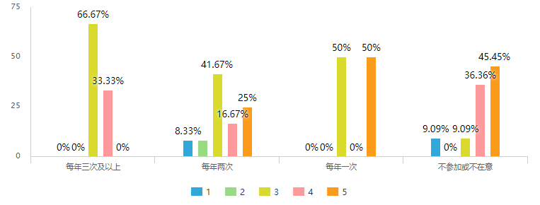

# Customer Validation Report
使用问卷星在线收集到32份问卷。
## Round 1
The first round is designed to validate the necessity of price comparison platform.
### Questions

### Result Analysis 1

* 从Q1可以看出用户在选购商品时最注重性价比，但Q2显示大部分用户会参加促销活动，说明用户对于商品的价格因素比较敏感。
* Q3显示大部分用户在买商品时会比较不同网站的价格，Q4显示大部分用户不太相信促销时商品降价并且需要收集信息做进一步判断，这说明用户在选购商品时存在寻求合适比价渠道的需求。
* Q5显示用户在判断商品是否降价时最常利用的渠道是商家标注的平时价格以及用户的评论，对搜索引擎和比价网站的利用程度不高，Q6也说明了大部分用户并不了解比价网站，这说明比价网站存在广阔的潜在市场需求。

## Round 2
The second round is designed to validate the specified functions of our system.
### Questions

### Result Analysis 2

* Q7说明了用户最在意商品历史价格追踪功能，其次是全网比价，最后是降价通知。Q8说明了用户对于优惠券，价格走势预测，店铺评分筛选，大V评论等可以帮助其买到更高性价比商品的拓展功能也有需求。

### Cross Analysis
交叉分析用来分析不同参加促销活动频率的人称为比价平台潜在用户的可能性。

* 由上图可得，参加促销活动频率越高对比价网站的了解程度越高

以下分别展示参加促销活动的频率对于用户对比价网站全网比价，历史价格追踪以及降价通知的重视程度：

* 从以上三张图可以看出，参加促销活动频率越高对比价网站的功能越感兴趣。 
## Conclusion
* 总体上来看，性价比是用户在选购商品时最重要的考虑因素，所以帮助用户买到更高性价比商品的服务很有必要。
* 但有一部分用户对促销活动并不关心，所以他们也不太在意通过更多渠道获取信息以确保在较低价买到商品，这部分用户并非比价平台Argus的潜在用户。
* Argus的潜在用户为那些参加促销活动频率较高，更加愿意通过较多渠道确保在较低价买到商品的用户。调研结果显示，他们对于比价网的各项功能（包括全网比较，商品历史价格追踪以及降价通知）均有较高兴趣。但目前这些潜在用户对比价网的了解程度普遍偏低，需要进一步的宣传推广。
* 在三项基本功能之外，用户对于优惠券，价格走势预测，店铺评分筛选，大V评论等可以帮助其买到更高性价比商品的拓展功能也有需求。后续可以考虑对这些拓展功能进行进一步的用户验证以及原型构建。